# 🦀 Rust sin Dolor: La Guía Visual y Directa al Grano
*Aprende gestión de memoria sin basura desde TypeScript y JavaScript con enfoque neurodivergente.*

---

\pagebreak

# Capítulo 1: ¿Por qué Rust? De C y JavaScript al Vigilante en la Entrada

> 🧠 **EN 10 SEGUNDOS (TDAH):** Rust te da la velocidad brutal de C sin que tu programa explote por corrupción de memoria, y sin el recolector de basura lento de JavaScript o Java. El compilador es tu vigilante personal de seguridad.

---

¿Por qué existe tanto revuelo con Rust? Para entenderlo, debemos mirar los dos extremos del mundo de la programación actual: **JavaScript** y **C/C++**.

Por un lado, JavaScript (y TypeScript) oculta la memoria. Un conserje automático llamado *Garbage Collector* (GC) limpia la basura por ti. Es cómodo, pero impredecible: de repente, tu app se congresa unos milisegundos porque el GC decidió limpiar la casa.

Por otro lado, C y C++ te dan control total del hardware. Tú pides memoria y tú debes liberarla. Si olvidas liberarla, tienes una fuga. Si la liberas dos veces o escribes donde no debes, tu programa sufre un fallo catastrófico (*Segmentation Fault*) o abre brechas de seguridad críticas.

Rust entra en escena como una tercera vía revolucionaria: **control total sin Garbage Collector, pero con un compilador estricto que te impide cometer errores de memoria antes de que tu código corra.**

---

## Memoria: El Baile de las Sillas

Para entender por qué Rust es diferente, mira este diagrama de cómo se gestiona la memoria en los diferentes lenguajes:


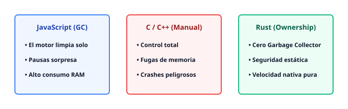


> 🟦 **CONEXIÓN TYPESCRIPT/JAVASCRIPT:** En TS, si creas un objeto gigante, el motor V8 se encarga de borrarlo cuando ya no se usa. En Rust, el compilador calcula exactamente en qué línea de código ese objeto muere y genera la instrucción de limpieza en el código máquina de forma milimétrica.

---

## Instalación y el Ecosistema Cargo

Para empezar a programar en Rust, necesitamos instalar dos herramientas principales: `rustc` (el compilador) y `cargo` (el gestor de paquetes y sistema de compilación).

La forma oficial y recomendada en sistemas Unix (Linux/macOS) o WSL en Windows es ejecutar:

```bash
curl --proto '=https' --tlsv1.2 -sSf https://sh.rustup.rs | sh
```

### Cargo vs npm: Tu nuevo mejor amigo

Si vienes de Node.js, `cargo` te resultará familiar de inmediato. Es el equivalente combinado a **npm + webpack + tsconfig**.

| Característica | Node.js (npm) | Rust (Cargo) |
| :--- | :--- | :--- |
| **Archivo de Configuración** | `package.json` | `Cargo.toml` |
| **Bloqueo de Dependencias** | `package-lock.json` | `Cargo.lock` |
| **Carpeta de Módulos** | `node_modules/` | `target/` |
| **Comando para Ejecutar** | `npm run start` | `cargo run` |
| **Comando para Compilar** | N/A (Interpretado/JIT)| `cargo build --release` |

---

## Anatomía de un Proyecto y el archivo `main.rs`

Crea un nuevo proyecto ejecutable usando la terminal con Cargo:

```bash
cargo new hola_rust
cd hola_rust
```

Esto generará la siguiente estructura de archivos:

```text
hola_rust/
├── Cargo.toml
└── src/
    └── main.rs
```

### El archivo `Cargo.toml`

Aquí defines los metadatos de tu aplicación y las librerías externas (llamadas *crates*):

```toml
[package]
name = "hola_rust"
version = "0.1.0"
edition = "2024"

[dependencies]
# Aquí agregarás tus librerías externas más adelante
```

### El archivo `src/main.rs`

Ábrelo con tu editor favorito (como VS Code). Este es el punto de entrada clásico de cualquier programa en Rust:

```rust
fn main() {
    println!("¡Hola, mundo desde Rust!");
}
```

- **`fn main()`**: Define la función principal donde inicia la ejecución del programa.
- **`println!`**: Es una **macro** de Rust (notalo por el signo de exclamación `!`). Imprime texto en la consola de manera optimizada y segura.

> 🟥 **FRENAZO DEL COMPILADOR:** En JavaScript puedes escribir `console.log(x)` sin declarar variables y el código corre (hasta que peta en producción). En Rust, si olvidas el punto y coma `;` al final de una sentencia o escribes mal una llave, el compilador de Rust no generará ningún binario. Te detendrá en seco y te señalará exactamente el carácter erróneo con una amabilidad quirúrgica.

\pagebreak

# Capítulo 2: Variables, Mutabilidad y Tipos con Peso Real

> 🧠 **EN 10 SEGUNDOS (TDAH):** En Rust, las variables son **inmutables por defecto** para evitar accidentes. Si quieres cambiar su valor, debes usar la palabra clave `mut`. Los tipos son estrictos y no hay conversiones mágicas.

---

## 1. Inmutabilidad por Defecto (`let` vs `mut`)

Cuando declaras una variable con `let` en Rust, su valor se graba en piedra. El compilador asume que no cambiará jamás. Si intentas modificarla más adelante, el compilador se detendrá y te lanzará un error.

Para permitir que una variable cambie, debes usar `let mut`.

```rust
fn main() {
    let puntuacion = 10; // Inmutable por defecto
    // puntuacion = 20;  // <-- Esto daría error de compilación

    let mut vidas = 3;   // Mutable (puede cambiar)
    println!("Vidas iniciales: {}", vidas);

    vidas = 2;           // Permitido porque usamos 'mut'
    println!("Vidas actualizadas: {}", vidas);
}
```

> 🟦 **CONEXIÓN TYPESCRIPT/JAVASCRIPT:** En JS/TS tienes `const` (que es inmutable en su referencia, pero sus propiedades internas pueden cambiar) y `let`. En Rust, `let` es verdaderamente inmutable a nivel de valor. Para cambiar el valor, necesitas obligatoriamente declarar `let mut`.


> 🟥 **FRENAZO DEL COMPILADOR:**
> ```text
> error[E0384]: cannot assign twice to immutable variable `puntuacion`
>   --> src/main.rs:3:5
>   |
> 2 |     let puntuacion = 10;
>   |        ----------
>   |        |
>   |        first assignment to `puntuacion`
>   |        help: consider introducing a mutable variable: `let mut puntuacion`
> ```
> *El compilador leyó tu código, vio que intentaste cambiar un valor inmutable y te ofreció la solución exacta antes de que ejecutes el programa.*

---

## 2. Shadowing (El arte de reutilizar nombres)

El *Shadowing* (sombra) no es lo mismo que cambiar el valor de una variable con `mut`. Consiste en declarar una **nueva** variable que reutiliza el nombre de una anterior usando la palabra clave `let` otra vez.

Esto te permite cambiar el tipo de dato o transformar el valor manteniendo el mismo identificador.

```rust
fn main() {
    let espacios = "   "; // Tipo String (&str)
    let espacios = espacios.len(); // Nuevo tipo: i32/usize (longitud)
    
    println!("Cantidad de espacios: {}", espacios);
}
```

Gracias al shadowing, la variable `espacios` pasa de ser un texto a ser un número entero en la siguiente línea, algo imposible si usaras `let mut`.

---

## 3. Tipos con Peso Real: Primitivos Numéricos y Booleans

En Rust, cada tipo de dato tiene un tamaño exacto en la memoria. No hay ambigüedades.

### Enteros (Signed vs Unsigned)
* **Con signo (`i`):** Pueden ser positivos y negativos (`i8`, `i16`, `i32`, `i64`, `i128`, `isize`).
* **Sin signo (`u`):** Solo números positivos, duplicando su rango positivo (`u8`, `u16`, `u32`, `u64`, `u128`, `usize`).

*Por defecto, si escribes un número entero suelto (ej: `42`), Rust le asignará el tipo `i32`.*

### Floats (Decimales)
* `f32` (Puntero flotante de 32 bits)
* `f64` (Puntero flotante de 64 bits - **Por defecto** por ser más preciso en CPUs modernas).

### Booleans
* `bool` (Ocupa exactamente 1 byte y solo acepta `true` o `false`).

---

## 4. Caracteres (`char`) vs Strings (`&str` y `String`)

Esta es una de las diferencias más importantes en Rust respecto a otros lenguajes.

* **`char` (Caracter):** Representa un único carácter Unicode. Se escribe con **comillas simples** (`'a'`, `'ñ'`, `'🚀'`). Ocupa exactamente **4 bytes** en memoria porque almacena puntos de código Unicode completos, no simples bytes de texto ASCII.
* **Strings (`&str` y `String`):** Son cadenas de texto completas y se escriben con **comillas dobles** (`"Hola Rust"`).

```rust
fn main/() {} // Cuidado con la sintaxis, el main correcto es sin barra diagonal:
```

```rust
fn main() {
    let letra: char = 'R';           // Comillas simples, 4 bytes
    let emoji: char = '🦀';          // Soporta emojis nativamente
    let saludo: &str = "Hola, Rust"; // Cadena estática prestada
}
```


---

## Resumen del Capítulo

1. **`let` es inmutable** por defecto. Si necesitas cambiar datos, declara `let mut`.
2. El **Shadowing** te permite reutilizar nombres de variables cambiando incluso su tipo.
3. Los tipos numéricos (`i32`, `u8`, `f64`) definen explícitamente cuántos bits consumen en la memoria.
4. `'r'` es un `char` de 4 bytes con comillas simples; `"rust"` es una cadena con comillas dobles.

\pagebreak

# Capítulo 3: Funciones, Sentencias y el Misterio del Punto y Coma

> 🧠 **EN 10 SEGUNDOS (TDAH):** En Rust, **quitar el punto y coma (`;`) al final de una línea significa "devuelve este valor automáticamente"**. Las sentencias hacen cosas; las expresiones producen valores.

---

Las funciones son los bloques de construcción fundamentales en Rust. Ya conoces `fn main()`, el punto de entrada de todo programa. Hoy vamos a desmitificar cómo devuelven datos y por qué un simple signo de puntuación cambia por completo el flujo de tu código.

## 1. Anatomía de una Función en Rust

Declarar una función es sencillo, pero exige precisión. Rust es un lenguaje fuertemente tipado: **debes** declarar el tipo de cada parámetro y el tipo de dato que la función va a retornar.

```rust
fn sumar(a: i32, b: i32) -> i32 {
    a + b // ¡Sin punto y coma! Esto es una expresión de retorno.
}

fn main() {
    let resultado = sumar(5, 10);
    println!("El resultado es: {}", resultado);
}
```

- `fn`: La palabra reservada para iniciar una función.
- `a: i32`: El parámetro `a` de tipo entero de 32 bits.
- `-> i32`: Indica que esta función devolverá un valor de tipo `i32`.

---

## 2. Sentencias (Statements) vs Expresiones (Expressions)

Esta es la trampa mental número uno para los desarrolladores que vienen de otros lenguajes. En Rust, casi todo es una **expresión**.

*   **Sentencia (Statement):** Una instrucción que realiza una acción y **no** devuelve un valor. Terminan con punto y coma (`;`). Ejemplo: `let x = 6;`
*   **Expresión (Expression):** Evalúa algo y **produce un valor**. Ejemplo: `5 + 6`, una llamada a función, o incluso un bloque de código `{ let x = 3; x + 1 }`.

> 🟦 **CONEXIÓN TYPESCRIPT/JAVASCRIPT:**
> En TypeScript/JavaScript moderno, estás acostumbrado a las arrow functions con retorno implícito:
> `const sumar = (a: number, b: number) => a + b;`
> En Rust, haces exactamente lo mismo, pero **omitiendo la flecha gorda (`=>`) y prohibiendo el punto y coma final**. Si le pones `;` al final en Rust, conviertes la expresión en una sentencia que devuelve `()`, el tipo vacío (*Unit*).

---

## 3. Visualizando el Poder del Punto y Coma

Mira este diagrama vectorial que explica visualmente qué pasa con y sin el punto y coma en el cuerpo de una función.


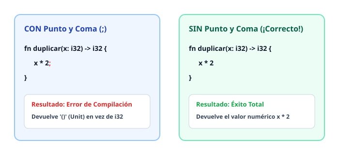


---

## 4. El Gran Error de Principiante

Es muy común que, por fuerza de costumbre muscular, pongas un punto y coma al final de la última línea de una función. Cuando lo haces, el compilador de Rust se pone firme.

> 🟥 **FRENAZO DEL COMPILADOR:**
> Si escribes esto:
> ```rust
> fn obtener_edad() -> u8 {
>     25; 
> }
> ```
> El compilador arrojará este error:
> ```text
> error[E0308]: mismatched types
>  --> src/main.rs:1:25
>   |
> 1 | fn obtener_edad() -> u8 {
>   |    ------------      ^^ expected `u8`, found `()`
> 2 |     25;
>   |       - help: remove this semicolon
> ```
> **Qué bug evitó:** Rust te protege de retornar silenciosamente datos vacíos o nulos cuando prometiste entregar un tipo de dato concreto. La ayuda del compilador (*help: remove this semicolon*) te muestra exactamente qué hacer.

---

## Resumen del Capítulo

1. Las funciones requieren tipos explícitos en sus parámetros y en su retorno (`-> T`).
2. Una **expresión** devuelve un valor; una **sentencia** ejecuta una acción y termina en `;`.
3. Para devolver un valor de forma implícita en Rust, **omite el punto y coma** en la última línea del bloque de código.

\pagebreak

# Capítulo 4: Tomando Decisiones: If Expresión y Bucles

> 🧠 **EN 10 SEGUNDOS (TDAH):** En Rust, los `if` y los bucles `loop` devuelven valores directamente. Puedes asignar un `if` a una variable sin necesidad de operadores ternarios raros.

---

## 1. El `if` no es una sentencia, ¡es una Expresión!

En otros lenguajes, un `if` solo ejecuta código. En Rust, como todo es una expresión, un `if` **devuelve un valor**. 

Imagina que quieres asignar una puntuación según una condición. Olvídate del operador ternario `condicion ? a : b`. En Rust, haces esto:

```rust
fn main() {
    let tengo_hambre = true;

    // El if entero se evalúa y su resultado se guarda en 'comida'
    let comida = if tengo_hambre {
        "Pizza" // Sin punto y coma (es la expresión de retorno)
    } else {
        "Agua"  // Sin punto y coma
    };

    println!("Voy a consumir: {}", comida);
}
```

> 🟦 **CONEXIÓN TYPESCRIPT/JAVASCRIPT:** En JS usas el operador ternario: `const comida = tengoHambre ? "Pizza" : "Agua";`. En Rust, el bloque `if/else` nativo hace exactamente eso, pero con la legibilidad de múltiples líneas si lo necesitas.

### Diagrama: El `if` como Expresión


> 🟥 **FRENAZO DEL COMPILADOR:** 
> Si pones un punto y coma al final de las ramas, el compilador fallará:
> ```rust
> let x = if true { 5; } else { 10; }; // Error: tipo de retorno es '()' (vacío)
> ```
> *Por qué:* El punto y coma convierte la expresión en una sentencia que descarta el valor. Recuerda: **sin punto y coma** en la última línea si quieres devolver el valor.

---

## 2. Bucles: El infinito controlado (`loop`)

Rust tiene tres tipos de bucles: `loop`, `while` y `for`. El rey de la flexibilidad es `loop`, porque crea un bucle infinito del que puedes **extraer un valor** al salir con `break`.

```rust
fn main() {
    let mut contador = 0;

    // El bucle loop puede retornar un valor usando break
    let resultado = loop {
        contador += 1;

        if contador == 10 {
            break contador * 2; // Rompe el bucle y devuelve 20
        }
    };

    println!("El resultado del bucle es: {}", resultado); // Imprime 20
}
```

> 🟦 **CONEXIÓN TYPESCRIPT/JAVASCRIPT:** En JS harías malabares con variables externas modificadas dentro de un `while(true)` o usarías patrones complejos de promesas. En Rust, `loop` con `break valor;` es una construcción nativa limpia y súper rápida.

---

## 3. Navegando con `while` y `for`

### El clásico `while`
Funciona exactamente igual que en otros lenguajes: se ejecuta mientras la condición sea verdadera.

```rust
fn main() {
    let mut energia = 3;

    while energia > 0 {
        println!("Energía restante: {}", energia);
        energia -= 1;
    }

    println!("¡Batería agotada!");
}
```

### El poderoso `for` (Adiós a los bugs de índices)
En Rust, el bucle `for` es seguro y elegante. No necesitas controlar índices manuales `i = 0; i < len; i++`. Iteras directamente sobre rangos o colecciones.

```rust
fn main() {
    // Iterar en un rango exclusivo (del 1 al 4)
    println!("--- Rango exclusivo ---");
    for numero in 1..5 {
        println!("Número: {}", numero);
    }

    // Iterar sobre un vector (colección)
    let lenguajes = vec!["Rust", "TypeScript", "Python"];

    println!("--- Colección ---");
    for lang in lenguajes {
        println!("Me gusta {}", lang);
    }
}
```

---

## Resumen del Capítulo

1. **`if` es expresión:** Devuelve valores directamente y se puede asignar a variables.
2. **Cuidado con los `;`:** No pongas punto y coma en la última línea de las ramas del `if` si quieres retornar un valor.
3. **`loop` con retorno:** Permite salir de bucles infinitos devolviendo datos mediante `break expresion;`.
4. **`for` seguro:** Prefiere `for` sobre `while` para recorrer rangos y colecciones; evita errores fuera de límites de forma nativa.

\pagebreak

# Capítulo 5: El Jefe Final: Ownership (Propiedad) y la Memoria

> 🧠 **EN 10 SEGUNDOS (TDAH):** Rust gestiona tu memoria sin un recolector de basura (Garbage Collector). Lo hace mediante una sola regla estricta: cada dato tiene un único dueño. Cuando el dueño sale de escena, el dato se borra solo. Fin de los memory leaks.

---

## 1. El Escenario: Stack (Pila) vs Heap (Montón)

Para entender cómo Rust maneja la memoria, imagina que estás organizando tu dormitorio.

El **Stack** es tu escritorio. Todo está ordenado, a la vista y al alcance de la mano. Las cosas aquí tienen un tamaño fijo y conocido (un número entero, un booleano). Poner y quitar cosas del escritorio es rapidísimo.

El **Heap** es el trastero del fondo del pasillo. Guardas cosas grandes, cuyo tamaño no conoces de antemano (un texto gigante, un archivo JSON kilométrico). En el escritorio (Stack) solo dejas una nota que dice: *"El texto gigante está en la caja 42 del trastero"*. Esa nota es un **puntero**.


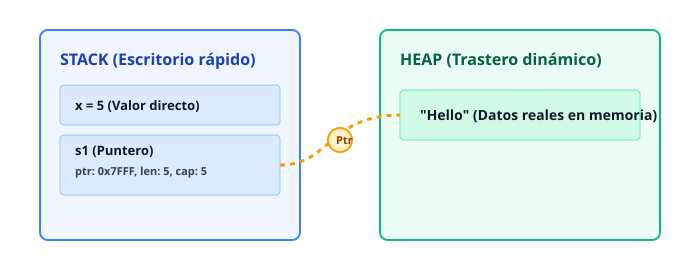


---

## 2. Las 3 Reglas de Oro del Ownership

Para que Rust compile tu código sin un Garbage Collector (como V8 en JS), te obliga a seguir estas tres reglas sagradas:

1. Cada valor en Rust tiene un **dueño** (llamado *owner*).
2. Solo puede haber **un dueño a la vez**.
3. Cuando el dueño sale del ámbito (*scope*, delimitado por llaves `{}`), el valor se **destruye** automáticamente (`drop`).

---

## 3. Transferencia de Propiedad (Move)

Mira este código en Rust:

```rust
fn main() {
    let s1 = String::from("Rust");
    let s2 = s1; // ¡Aquí ocurre la magia oscura!

    // println!("{}", s1); // Error de compilación si descomentas esto
}
```

> 🟦 **CONEXIÓN TYPESCRIPT/JAVASCRIPT:** En JS, si haces `let s2 = s1;`, ambos apuntan al mismo objeto en el Heap (copia por referencia implícita). Si modificas uno, el otro sufre cambios inesperados. En Rust, `s2 = s1` **transfiere la propiedad**. `s1` deja de ser válido instantáneamente. JS te oculta esto; Rust te lo muestra de frente para evitar bugs.

### ¿Por qué `s1` se invalida con `let s2 = s1`?

Para evitar **doble liberación de memoria** (*double free bug*). Si tanto `s1` como `s2` apuntaran al mismo bloque en el Heap, al terminar la función, ambos intentarían borrar el mismo espacio de memoria dos veces. Eso provoca fallos de seguridad críticos. 

Rust previene esto haciendo que `s1` muera en el momento exacto en que sus datos se mudan a `s2`.


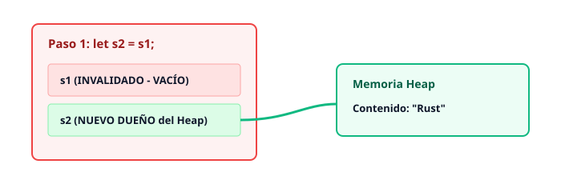


---

> 🟥 **FRENAZO DEL COMPILADOR:**
> 
> Si intentas usar `s1` después de asignarlo a `s2`, obtendrás este error:
> 
> ```text
> error[E0382]: use of moved value: `s1`
>  --> src/main.rs:5:20
>   |
> 3 |     let s2 = s1;
>   |              -- value moved here
> 4 | 
> 5 |     println!("{}", s1);
>   |                    ^^ value used here after move
> ```
> 
> **¿Qué bug evitó?** Evitó que leas una variable que ya no controla sus recursos, previniendo comportamientos indefinidos en memoria RAM que en C o C++ causarían pantallas azules o agujeros de seguridad.

\pagebreak

# Capítulo 6: Borrowing: El Arte de Prestar sin Perder la Propiedad

> 🧠 **EN 10 SEGUNDOS (TDAH):** Prestar (*borrow*) significa permitir que otra función o variable use tus datos sin robarte la propiedad. Usas `&` para leer y `&mut` para modificar. Al terminar su turno, el permiso se devuelve automáticamente.

---

Imagina que tienes un libro de cómics favorito. Quieres que tu amigo lo lea, pero no quieres regalárselo para siempre. Lo que haces es **prestárselo** un rato. Tu amigo lo lee, te lo devuelve, y tú sigues siendo el dueño legítimo. 

En Rust, esto se llama **Borrowing** (Préstamo). En lugar de transferir la propiedad (*Move*) cada vez que pasamos una variable, creamos una **referencia** apuntando a los datos originales.


---

## 1. Referencias Inmutables (`&T`): El Club de Lectura

Cuando antepones un `&` a un tipo, creas una **referencia inmutable**. Esto significa que puedes **leer** los datos, pero **no puedes cambiarlos**.

```rust
fn main() {
    let titulo = String::from("Rust sin Dolor");

    // Pasamos una referencia inmutable con &titulo
    imprimir_titulo(&titulo);

    // ¡La variable 'titulo' sigue viva y usable aquí!
    println!("Aun tengo mi titulo: {}", titulo);
}

fn imrimir_titulo(s: &String) {
    // s es una referencia inmutable
    println!("Leyendo: {}", s);
} // s sale de ámbito, pero el dueño original no pierde nada
```

> 🟦 **CONEXIÓN TYPESCRIPT/JAVASCRIPT:** En JS/TS, **todos** los objetos y arrays se pasan por referencia de forma predeterminada y mutable. Cualquiera puede modificar el objeto original por debajo, causando bugs fantásticos (y terroríficos). Rust te obliga a declarar explícitamente cuándo cedes acceso y si ese acceso permite alterar el valor.

---

## 2. Referencias Mutables (`&mut T`): El Escritor Solitario

¿Qué pasa si quieres que una función modifique tus datos sin adueñarse de ellos? Usas una **referencia mutable** (`&mut`).

```rust
fn main() {
    let mut puntaje = 10; // Debe ser mut para permitir préstamos mutables

    agregar_bonus(&mut puntaje); // Prestamos con permiso de escritura

    println!("Nuevo puntaje: {}", puntaje); // Imprime 20
}

fn agregar_bonus(p: &mut i32) {
    *p += 10; // Desreferenciamos con * para modificar el valor original
}
```

Para cambiar el valor dentro de la función, usamos el operador de desreferencia `*p`. Esto le dice a Rust: *"Ve al lugar de memoria al que apunta esta referencia y cambia el valor guardado allí"*.

---

## 3. La Ley Sagrada de Rust: Lectores vs. Escritores

Aquí es donde el compilador se pone estricto y te salva la vida. La regla de oro del sistema de tipos de Rust es:

> **Puedes tener CUALQUIER cantidad de referencias inmutables (`&T`) a la vez, o una ÚNICA referencia mutable (`&mut T`). NUNCA ambas al mismo tiempo.**

Imagina que estás escribiendo en un diario personal (`&mut`) y cinco amigos están leyendo el mismo diario por encima de tu hombro (`&`). Es un caos absoluto: lo que leen cambia mientras lo miran. Rust prohíbe esta inestabilidad en tiempo de compilación.


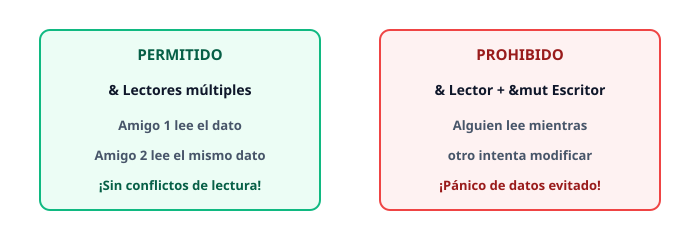


---

> 🟥 **FRENAZO DEL COMPILADOR:**
> Intenta hacer esto en tu código:
> ```rust
> let mut texto = String::from("Hola");
> let r1 = &texto; // Primer préstamo (inmutable)
> let r2 = &mut texto; // Segundo préstamo (mutable)
> println!("{} y {}", r1, r2);
> ```
> **El compilador gritará:**
> *cannot borrow `texto` as mutable because it is also borrowed as immutable*. 
> **Qué bug evitó:** Evitó que `r1` intente leer un texto cuya memoria subyacente podría haber sido redimensionada y movida en el Heap por `r2`, previniendo un cuelgue catastrófico o una lectura de basura en memoria.


\pagebreak

# Capítulo 7: Slices: Ventanas a Trozos de Memoria sin Copiar

> 🧠 **EN 10 SEGUNDOS (TDAH):** Un `slice` es una ventana de lectura que se asoma a una colección existente sin clonarla ni robar su propiedad. Es como mirar por la rendija de una puerta: ves lo que hay dentro, pero no te lo llevas a casa.

---

### El Problema de los Índices Desconectados

Imagínate que tienes una lista de tareas pendientes. Le pides a una función que te devuelva las primeras tres tareas usando índices numéricos (`0..3`). 

En lenguajes tradicionales, devuelves esos números y cruzas los dedos. ¿Qué pasa si el array original cambia, se reordena o se borra por completo? Los números ya no significan nada, o peor aún, apuntan a basura en memoria.

Rust previene esto mediante **slices**. Un slice no es solo un número: es una estructura ligera de dos palabras en la memoria Stack que guarda:
1. Un puntero al primer elemento del array u origen en el Heap.
2. La longitud exacta de la ventana.


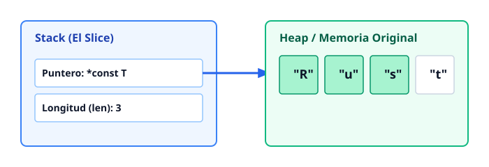


> 🟦 **CONEXIÓN TYPESCRIPT/JAVASCRIPT:** En JS, si haces `str.slice(0, 3)`, el motor crea un **nuevo string** duplicando caracteres en memoria. En TypeScript, los arrays devuelven sub-arreglos (`array.slice()`) que también son copias superficiales. En Rust, `&str` o `&[T]` **jamás copian datos**: prestan una referencia directa al bloque original.

---

### String Slices: `&str` vs `String`

Un `String` es una estructura propietaria que vive en el Heap, es dinámica y puede crecer. En cambio, un `&str` es un **slice de string**, una vista inmutable hacia UTF-8 válido.

```rust
fn main() {
    let saludo = String::from("Hola, Rustáceos");

    // Creamos slices usando rangos inclusivos/exclusivos
    let hola: &str = &saludo[0..4];
    let rust: &str = &saludo[6..10];

    println!("Ventana 1: {}", hola);
    println!("Ventana 2: {}", rust);
}
```

#### Regla de Oro de las Firmas de Funciones
Si escribes una función que acepta texto, **nunca pidas `&String`**. Pide siempre `&str`. ¿Por qué? Porque un `&str` acepta tanto literales de texto estáticos (`"hola"`) como referencias a `String` (`&mi_string`), dándole máxima flexibilidad a tu código.

```rust
fn imprimir_texto(texto: &str) {
    println!("Texto recibido: {}", texto);
}

fn main() {
    let s = String::from("Dinámico");
    let literal = "Estático";

    imprimir_texto(&s);        // Funciona perfectamente
    imprimir_texto(literal);   // También funciona perfectamente
}
```

---

### Slices de Arrays y Colecciones Genéricas

Los slices no son exclusivos de textos. Funcionan con cualquier tipo de colección lineal, como arrays estáticos o vectores (`Vec<T>`). La sintaxis universal para un slice de tipo genérico es `&[T]`.

```rust
fn procesar_numeros(lista: &[i32]) {
    println!("El primer número del slice es: {}", lista[0]);
    println!("La longitud de este slice es: {}", lista.len());
}

fn main() {
    // Array en el Stack
    let numeros_stack: [i32; 5] = [10, 20, 30, 40, 50];
    
    // Vector en el Heap
    let numeros_heap: Vec<i32> = vec![100, 200, 300];

    // Ambos se pueden pasar como slice gracias a la magia del coercion de Rust
    procesar_numeros(&numeros_stack[1..4]); // Pasa [20, 30, 40]
    procesar_numeros(&numeros_heap[..2]);     // Pasa [100, 200]
}
```


---

### Prevención de Errores en Compilación

El sistema de ownership y lifetimes de Rust brilla con intensidad al trabajar con slices. El compilador actúa como un guardián implacable contra los punteros colgantes (*dangling pointers*).

> 🟥 **FRENAZO DEL COMPILADOR:**
> 
> Intenta compilar este código donde un slice intenta sobrevivir al objeto que lo creó:
> 
> ```rust
> fn devolver_slice() -> &str {
>     let s = String::from("Ayuda");
>     &s[..3] // ¡ERROR! Intentas retornar un slice de una variable local
> }
> ```
> 
> **El Compilador grita:**
> ```text
> error[E0515]: cannot return value referencing local variable `s`
>   --> src/main.rs:3:5
>   |
> 3 |     &s[..3]
>   |     - ^--`s` is borrowed here
>   |     |
>   |     returns a value referencing data owned by the current function
> ```
> **Por qué te salva la vida:** La variable `s` muere al finalizar la función `devolver_slice()`. Si Rust te dejara retornar ese `&str`, estarías apuntando a una dirección de memoria liberada, lo que en C o C++ provocaría fallos de seguridad críticos (Vulnerabilidades de tipo *Use-After-Free*). Rust lo bloquea antes de que escribas tu primer test.


\pagebreak

# Capítulo 8: Structs: Modelando Datos sin Clases Clásicas

> 🧠 **EN 10 SEGUNDOS (TDAH):** Rust no usa clases ni herencia. Usa **structs** para agrupar datos y bloques `impl` para ponerles funciones y métodos. Simple, plano y sin jerarquías locas.

---

En Rust, los objetos y las clases de otros lenguajes se dividen en dos piezas separadas: 
1. Los **datos** viven en un `struct`.
2. Las **acciones** viven en un bloque `impl` (implementation).

Esta separación hace que el código sea mucho más fácil de leer para un cerebro con TDAH: sabes exactamente dónde están las variables y dónde están las funciones.


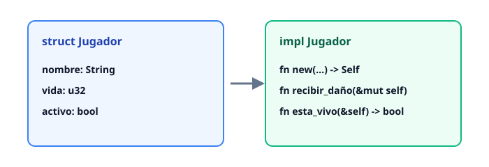


---

## 1. Definiendo e Instanciando Structs

Un `struct` es una estructura de datos con nombre que agrupa varios valores relacionados. 

```rust
// Definimos el struct
struct Jugador {
    nombre: String,
    vida: u32,
    puntuacion: u64,
}

fn main() {
    // Instanciamos el struct
    let jugador1 = Jugador {
        nombre: String::from("Ferris"),
        vida: 100,
        puntuacion: 4200,
    };

    println!("Jugador: {}, Vida: {}", jugador1.nombre, jugador1.vida);
}
```

> 🟦 **CONEXIÓN TYPESCRIPT/JAVASCRIPT:** En TypeScript usas interfaces o tipos (`type User = { name: string; age: number }`) solo para chequear tipos en tiempo de compilación; en JavaScript plano eso desaparece. En Rust, un `struct` es real, vive en la memoria binaria de tu programa y define exactamente cómo se empaquetan los bytes.

---

## 2. Métodos y el bloque `impl`

Para asociar funciones a un `struct`, usamos la palabra clave `impl` (abreviatura de *implementation*).

Dentro de un bloque `impl`, el primer parámetro de un método suele ser `self`, que representa la instancia del struct que está llamando a la función.

Tenemos tres formas de recibir `self` según lo que necesitemos hacer:
1. `&self`: Solo lectura (toma prestado el struct sin modificarlo).
2. `&mut self`: Lectura y escritura (modifica el struct).
3. `self`: Consumo total (destruye el struct y toma posesión de sus datos).

```rust
struct Jugador {
    nombre: String,
    vida: u32,
}

impl Jugador {
    // Método de solo lectura (&self)
    fn saludar(&self) {
        println!("¡Hola, soy {}!", self.nombre);
    }

    // Método de modificación (&mut self)
    fn recibir_daño(&mut self, cantidad: u32) {
        self.vida = self.vida.saturating_sub(cantidad);
        println!("{} recibió daño. Vida restante: {}", self.nombre, self.vida);
    }
}

fn main() {
    let mut p = Jugador {
        nombre: String::from("Rustacean"),
        vida: 100,
    };

    p.saludar();         // Llama a &self
    p.recibir_daño(25);  // Llama a &mut self
}
```

---

## 3. Constructores Asociados (`Self::new`)

Rust no tiene la palabra clave `constructor` como JavaScript o TypeScript. En su lugar, por convención se crea una función asociada llamada `new` que devuelve una nueva instancia del `struct`.

Observa el uso de `Self` (con la 'S' mayúscula), que actúa como un alias del tipo del struct en el que estás trabajando.

```rust
struct Coordenada {
    x: i32,
    y: i32,
}

impl Coordenada {
    // Función asociada (no recibe self, se llama con Coordenada::new())
    fn new(x: i32, y: i32) -> Self {
        Self { x, y }
    }

    // Método normal que lee los datos
    fn mostrar(&self) {
        println!("Posición: ({}, {})", self.x, self.y);
    }
}

fn main() {
    // Usamos el constructor
    let punto = Coordenada::new(10, 20);
    punto.mostrar();
}
```

> 🟥 **FRENAZO DEL COMPILADOR:** Si intentas llamar a un método que modifica el struct (`&mut self`) pero olvidaste marcar tu variable como mutable (`let mut obj = ...`), Rust te detendrá en seco:
> 
> ```text
> error[E0596]: cannot borrow `p` as mutable, as it is not declared as mutable
>   --> src/main.rs:20:5
>   |
> 18 |     let p = Jugador { ... };
>   |         - help: consider changing this to be mutable: `let mut p`
> 19 |     p.recibir_daño(25);
>   |     ^^^^^^^^^^^^^^^^^^ cannot borrow as mutable
> ```
> *El compilador te cuida la espalda:* Te obliga a declarar explícitamente qué datos pueden cambiar en tu programa, evitando efectos secundarios ocultos tan comunes en JavaScript.

\pagebreak

# Capítulo 9: Enums con Datos y el Fin de los Errores por Null

> 🧠 **EN 10 SEGUNDOS (TDAH):** En Rust, los `enum` pueden guardar datos adentro, y el infame `null` no existe. Usamos `Option<T>` para representar algo que puede estar o no, obligándote a manejar el caso vacío de forma segura.

---

### El error del billón de dólares

En lenguajes antiguos, Tony Hoare inventó la referencia `null` en 1965 porque era "fácil de implementar". Él mismo lo llamó su error de los mil millones de dólares. 

¿Por qué? Porque intentar acceder a una propiedad o método de un valor `null` o `undefined` rompe tu aplicación en producción de la nada. Rust elimina este problema de raíz: no hay valores nulos.


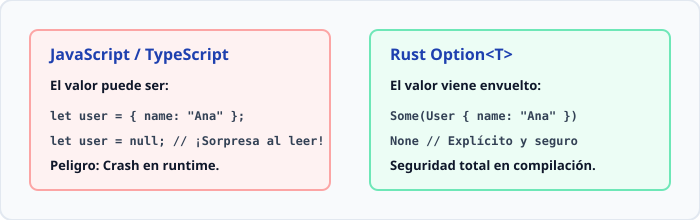


---

### Enums Enriquecidos: Mucho más que simples números

En lenguajes como C o Java, un `enum` es solo una lista de números enteros disfrazados. En Rust, los `enum` son **tipos algebraicos de datos**. Cada variante puede contener estructuras de datos completamente diferentes.

```rust
// Definimos un enum para manejar mensajes de una interfaz gráfica
enum Mensaje {
    Salir,                        // Sin datos
    Escribir(String),             // Contiene un String
    Coordenada { x: i32, y: i32 }, // Contiene una estructura con nombres
    CambiarColor(u8, u8, u8),     // Contiene tres números
}

fn procesar_mensaje(msg: Mensaje) {
    match msg {
        Mensaje::Salir => {
            println!("Saliendo del programa...");
        }
        Mensaje::Escribir(texto) => {
            println!("Texto recibido: {}", texto);
        }
        Mensaje::Coordenada { x, y } => {
            println!("Mover a X: {}, Y: {}", x, y);
        }
        Mensaje::CambiarColor(r, g, b) => {
            println!("Color RGB: {}, {}, {}", r, g, b);
        }
    }
}
```

> 🟦 **CONEXIÓN TYPESCRIPT/JAVASCRIPT:** En TypeScript puedes lograr algo similar usando *Discriminated Unions* (`type Msg = { type: 'salir' } | { type: 'escribir', texto: string }`). La diferencia clave es que Rust valida de forma estricta en el compilador que **nunca** olvides cubrir un caso en el `match`.

---

### El tipo `Option<T>` al rescate

Cuando una función puede devolver un resultado o nada, Rust no devuelve `null`. Devuelve una variante del enum `Option<T>`, que está definido en la biblioteca estándar de esta manera:

```rust
enum Option<T> {
    Some(T),
    None,
}
```

Imagina que buscas un usuario en una base de datos. O lo encuentras (`Some(usuario)`), o no existe (`None`).

```rust
fn buscar_usuario(id: u32) -> Option<String> {
    if id == 1 {
        Some(String::from("Carlos"))
    } else {
        None
    }
}

fn main() {
    let resultado = buscar_usuario(2);

    match resultado {
        Some(nombre) => println!("Usuario encontrado: {}", nombre),
        None => println!("El usuario no existe en el sistema."),
    }
}
```

> 🟥 **FRENAZO DEL COMPILADOR:** 
> Si intentas usar un `Option<String>` directamente como si fuera un `String` sin antes abrir la caja con `match` o métodos seguros, el compilador se detendrá inmediatamente:
> ```text
> error[E0308]: mismatched types
>  --> src/main.rs:10:20
>   |
> 9 |     let longitud = resultado.len();
>   |                    ^^^^^^^^^^^^^^^ no method named `len` found for enum `Option<String>`
>   |
>   = note: Usar `match` o métodos como `.unwrap_or()` para acceder al valor interno.
> ```
> El compilador te obliga físicamente a pensar: *"¿Qué pasa si esto es `None`?"*.

---

### Desempaquetado seguro y elegante

Aunque `match` es la herramienta definitiva, Rust provee métodos muy útiles para casos comunes sin escribir tanta planilla de código:

1. **`unwrap_or(valor_por_defecto)`**: Si es `Some(v)`, devuelve `v`. Si es `None`, devuelve el valor por defecto que tú elijas.
2. **`if let`**: Ideal cuando solo te interesa un caso específico y quieres ignorar el resto.


Ejemplo práctico usando `if let`:

```rust
fn main() {
    let configuracion_puerto: Option<u16> = Some(8080);

    // Solo nos importa si hay un puerto configurado
    if let Some(puerto) = configuracion_puerto {
        println!("Servidor corriendo en el puerto {}", puerto);
    } else {
        println!("Usando puerto por defecto.");
    }
}
```


\pagebreak

# Capítulo 10: Pattern Matching: La Máquina Clasificadora Perfecta

> 🧠 **EN 10 SEGUNDOS (TDAH):** El `match` es un switch con esteroides. Obliga a tu código a considerar *absolutamente todos* los casos posibles de un dato. Si olvidas uno, el compilador explota antes de que toques el teclado.

---

El pattern matching en Rust no es solo comparar valores; es una **máquina clasificadora** que desarma estructuras complejas, extrae sus datos internos y dirige el flujo del programa con precisión milimétrica.

## 1. La instrucción `match` exhaustiva

Imagina una máquina de correos ultra estricta. Si llega un paquete, debe estar clasificado en una categoría conocida. No existe el "caso por defecto" flojo (`default` en JS) a menos que lo pidas explícitamente.

> 🟦 **CONEXIÓN TYPESCRIPT/JAVASCRIPT:** En JS usas `switch`. Si olvidas un `break`, el código cae en cascada (bug clásico). En TS usas `switch` con `never` para forzar exhaustividad. Rust hace esto de serie, por diseño y sin trucos.

```rust
enum EstadoServidor {
    Apagado,
    Iniciando(u32), // Contiene el puerto de arranque
    Activo(&amp;'static str), // Contiene la URL
}

fn auditar_estado(estado: EstadoServidor) {
    match estado {
        EstadoServidor::Apagado => {
            println!("El servidor está durmiendo.");
        }
        EstadoServidor::Iniciando(puerto) => {
            println!("Arrancando en el puerto {}...", puerto);
        }
        EstadoServidor::Activo(url) => {
            println!("¡En línea y sirviendo en {}!", url);
        }
    }
}
```

---

## 2. Desestructuración de datos en variantes

El `match` abre las cajas (`structs`, `enums`, `tuples`) y te entrega su contenido directamente en las variables que defines en los brazos (`arms`).

```rust
struct Coordenada {
    x: i32,
    y: i32,
}

fn analizar_punto(punto: Coordenada) {
    match punto {
        Coordenada { x: 0, y: 0 } => println!("Origen exacto"),
        Coordenada { x, y: 0 } => println!("Sobre el eje X en {}", x),
        Coordenada { x: 0, y } => println!("Sobre el eje Y en {}", y),
        Coordenada { x, y } => println!("Punto libre en ({}, {})", x, y),
    }
}
```

### Visualizando el Desarme de Datos (SVG)


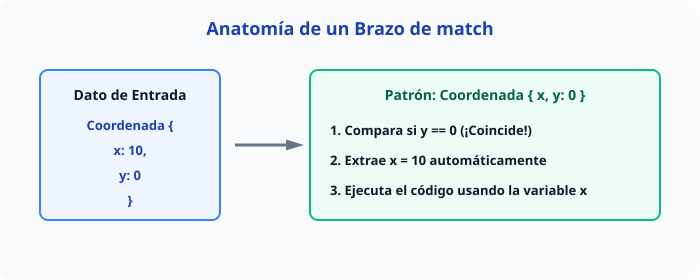


---

## 3. Atajos elegantes: `if let` y `let...else`

A veces, un `match` completo es demasiado pesado cuando solo te importa **un** caso y quieres ignorar el resto. Para eso existen los atajos del "camino feliz" (*happy path*).

### `if let`: Cuando solo te importa un caso

```rust
fn procesar_config(modo_oscuro: Option<bool>) {
    // Si es Some(true), entra. Si es None o Some(false), lo ignora limpiamente.
    if let Some(true) = modo_oscuro {
        println!("Activando interfaz nocturna...");
    }
}
```

### `let...else`: Protección temprana (*guard clauses*)

Introducido para evitar la pirámide de la perdición (anidaciones profundas). Si el patrón falla, ejecutas código que rompe el flujo obligatoriamente (`return`, `break`, `panic!`).

```rust
fn obtener_id(usuario: Option<u32>) -> u32 {
    // Si es Some(id), lo extrae. Si es None, ejecuta el bloque else y sale.
    let Some(id) = usuario else {
        return 0; // Valor por defecto de salida rápida
    };

    id + 100 // Código principal limpio, sin indentación extra
}
```

> 🟥 **FRENAZO DEL COMPILADOR:** Si omites un caso en un `match`, el compilador te gritará con furia:
> `error[E0004]: non-exhaustive patterns: \`None\` not covered`.
> **Bug evitado:** Cero excepciones en producción por estados no contemplados como `null` o `undefined` imprevistos. Rust te obliga a pensar en cada escenario antes de compilar.

\pagebreak

# Capítulo 11: Colecciones I: Vectores Vec&lt;T&gt; (Los Arrays Dinámicos)

> 🧠 **EN 10 SEGUNDOS (TDAH):** Un `Vec<T>` es una lista de elementos que puede crecer, encogerse y cambiar en tiempo de ejecución. A diferencia de un array fijo, vive en el Heap, por lo que Rust gestiona su memoria automáticamente sin que tengas que liberarla a mano.

---

### El Problema del Espacio: Arrays Fijos vs Vectores

Imagina que organizas una fiesta. Un array clásico en Rust (`[i32; 3]`) es como reservar una mesa exacta para tres personas. Si llega un cuarto invitado, la mesa colapsa. No puedes cambiar su tamaño.

El vector (`Vec<T>`) es un organizador profesional: empieza con un espacio inicial, y si la fiesta crece, busca un local más grande, muda a todos los invitados de golpe y destruye el local viejo.


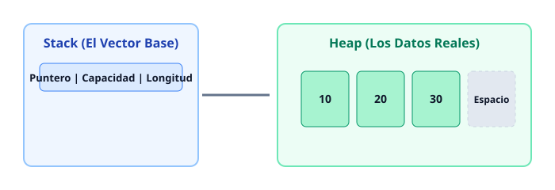


---

### Crear, Añadir y Leer Elementos

Para crear un vector vacío o con valores iniciales, usamos la macro `vec!` o la función asociada `Vec::new()`.

```rust
fn main() {
    // Forma rápida con macro (inferencia de tipos automática)
    let mut numeros: Vec<i32> = vec![1, 2, 3];

    // Añadir un elemento al final con push
    numeros.push(4);
    numeros.push(5);

    // Leer el primer elemento usando indexación directa
    let primero = numeros[0]; 
    println!("El primer número es: {}", primero);
}
```

> 🟦 **CONEXIÓN TYPESCRIPT/JAVASCRIPT:** En JS/TS, un array (`let arr = [1, 2, 3]`) puede mezclar tipos libremente y crece con `.push()`. En Rust, el vector `Vec<T>` es estrictamente homogéneo: **todos** sus elementos deben ser exactamente del mismo tipo `T`.

---

### Acceso Seguro: Indexación Directa `[]` vs `.get()`

La indexación directa (`numeros[indice]`) es rápida, pero tiene un peligro mortal si te equivocas de número: **hace que tu programa falle (panic)** y se cierre abruptamente.

El método `.get(indice)` devuelve un `Option<&T>`, obligándote a manejar el caso de que la posición no exista.

```rust
fn main() {
    let vector = vec![10, 20, 30];

    // PELIGROSO: Si pides el índice 99, el programa explota aquí.
    // let elemento_malo = vector[99]; 

    // SEGURO: Usando .get() manejamos el error con gracia
    match vector.get(99) {
        Some(valor) => println!("Encontrado: {}", valor),
        None => println!("¡Ups! Esa posición no existe en el vector."),
    }
}
```

> 🟥 **FRENAZO DEL COMPILADOR:**
> ```text
> error[E0502]: cannot borrow `vector` as mutable because it is also borrowed as immutable
>   --> src/main.rs:5:5
>    |
> 4  |     let elemento = &vector[0];
>    |                     ------ immutable borrow occurs here
> 5  |     vector.push(4);
>    |     ^^^^^^^^^^^^^^ mutable borrow occurs here
> ```
> **Por qué ocurre:** Rust te protege de un bug clásico de C++. Si guardas una referencia a un elemento y luego haces `.push()`, el vector podría mudarse a otra dirección de memoria en el Heap, dejando tu referencia apuntando a la basura. Rust lo detecta en tiempo de compilación y lo prohíbe.

---

### Iteración Mutable e Inmutable

Puedes recorrer los elementos de un vector para leerlos o para modificarlos sobre la marcha.

```rust
fn main() {
    let mut puntuaciones = vec![50, 70, 90];

    // 1. Iteración mutable (&mut) para modificar valores
    for puntaje in &mut puntuaciones {
        *puntaje += 10; // Usamos el operador de desreferencia (*) para cambiar el valor al que apunta
    }

    // 2. Iteración inmutable (&) para solo leer
    for puntaje in &puntuaciones {
        println!("Puntuación actualizada: {}", puntaje);
    }
}
```


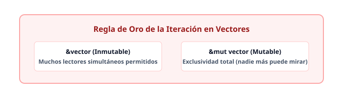


---

### Guardar Varios Tipos con Enums

¿Qué pasa si necesitas un vector que guarde texto, números y booleanos mezclados, como harías en un array de JavaScript? Como el `Vec<T>` exige un solo tipo `T`, usamos un `enum` para empaquetar diferentes variantes bajo un mismo tipo de dato.

```rust
#[derive(Debug)]
enum ElementoCelda {
    Texto(String),
    Numero(i32),
    Booleano(bool),
}

fn main() {
    // Creamos un vector homogéneo cuyo tipo es 'ElementoCelda'
    let hoja_excel: Vec<ElementoCelda> = vec![
        ElementoCelda::Texto(String::from("Edad")),
        ElementoCelda::Numero(30),
        ElementoCelda::Booleano(true),
    ];

    for celda in &hoja_excel {
        match celda {
            ElementoCelda::Texto(t) => println!("Celda de texto: {}", t),
            ElementoCelda::Numero(n) => println!("Celda numérica: {}", n),
            ElementoCelda::Booleano(b) => println!("Celda booleana: {}", b),
        }
    }
}
```

¡Listo! Ya dominas la estructura de datos más utilizada en Rust. En el siguiente capítulo veremos cómo manejar texto real en formato UTF-8 con `String`.

\pagebreak

# Capítulo 12: Colecciones II: Strings UTF-8 en Profundidad

> 🧠 **EN 10 SEGUNDOS (TDAH):** Los strings en Rust no son arreglos simples de caracteres; son secuencias seguras de bytes codificados en UTF-8. Como un carácter puede ocupar de 1 a 4 bytes, Rust te prohíbe usar índices como `s[0]` para evitar romper la memoria y corromper texto internacional.

---

## 1. El gran misterio: ¿Por qué no existe `s[0]` en Rust?

En JavaScript, si tienes un string, puedes hacer `s[0]` y obtienes la primera letra de inmediato. O eso crees. Bajo el capó, JS a veces sufre con caracteres especiales y emojis porque maneja mal los pares de sustitutos UTF-16.

Rust decide no mentirte. Un `String` es un vector de bytes (`Vec<u8>`) validado estrictamente para cumplir con el estándar UTF-8. 

Mira esta ilustración para entender por qué un índice directo destruiría el rendimiento y la seguridad:


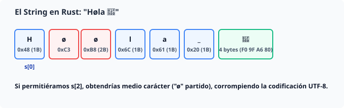


> 🟦 **CONEXIÓN TYPESCRIPT/JAVASCRIPT:** En JS, `s[0]` busca unidades de código UTF-16. Los emojis altos como `🦀` usan dos unidades (un par de sustitutos). Si intentas cortarlos con métodos ingenuos de String, terminas rompiendo caracteres visuales (graphemes) y generando símbolos extraños.

---

## 2. Los Tres Niveles de Vista de un String

Para trabajar con texto en Rust sin volverte loco, debes entender que el mismo string se puede ver de tres formas distintas:

1. **Bytes (`.bytes()`):** Secuencia pura de números `u8`. Ideal para procesamiento de bajo nivel o red.
2. **Valores escalares (`.chars()`):** Caracteres Unicode individuales (`char` de 4 bytes). Por ejemplo, `🦀` es un `char`.
3. **Grafemas (Graphemes):** Lo que tus ojos humanos perciben como una sola letra con acentos o combinaciones (requiere la crate externa `unicode-segmentation`).

```rust
fn main() {
    let saludo = "Høla 🦀";

    // 1. Como bytes puros
    println!("Bytes: {}", saludo.len()); // Muestra los bytes totales (8 bytes)

    // 2. Como valores escalares (.chars())
    for c in saludo.chars() {
        print!("{} ", c);
    }
    // Imprime: H ø l a   🦀
}
```

> 🟥 **FRENAZO DEL COMPILADOR:**
> Si intentas hacer esto en tu código:
> ```rust
> fn main() {
>     let s = String::from("Hola");
>     let letra = s[0]; // Error de compilación
> }
> ```
> El compilador te arrojará este error inconfundible:
> ```text
> error[E0277]: the type `str` cannot be indexed by `usize`
>    --> src/main.rs:3:19
>     |
> 3 |     let letra = s[0];
>     |                   ^ `str` cannot be indexed by `usize`
>     |
>     = help: the trait `Index<usize>` is not implemented for `str`
>     = help: the trait `Index<Range<usize>>` is implemented for `str`, but with caution!
> ```
> **¿Qué bug evitó?** Evitó que escribas código O(1) falso que en realidad requeriría recorrer el string desde el inicio si se permitiera indexación arbitraria sobre grafemas de longitud variable.

---

## 3. Manipulación Eficiente: `push_str` y `format!`

Como los strings crecen y se encogen en el Heap, modificar un `String` mutable es muy similar a manipular un `Vec<T>`.

### Agregando contenido con `push` y `push_str`

- `push(&mut self, ch: char)`: Añade un único carácter Unicode.
- `push_str(&mut self, string: &str)`: Añade un slice de string completo sin tomar posesión de él.

```rust
fn main() {
    let mut mensaje = String::from("Rust");
    
    mensaje.push_str(" es");
    mensaje.push(' ');
    mensaje.push_str("genial 🚀");

    println!("{}", mensaje); // "Rust es genial 🚀"
}
```

### Concatenación limpia con la macro `format!`

Cuando necesitas unir múltiples variables sin lidiar con reglas complejas de ownership de los operadores `+`, la macro `format!` es tu mejor aliada. Funciona exactamente igual que `println!`, pero en lugar de imprimir en consola, **devuelve un nuevo `String`**.

```rust
fn main() {
    let lenguaje = "Rust";
    let version = 2024;
    
    // format! toma referencias prestadas sin consumir las variables originales
    let info = format!("Estás programando en {} edición {}.", lenguaje, version);
    
    println!("{}", info);
}
```

> 🧠 **EN 10 SEGUNDOS (TDAH):** Usa `.chars()` si quieres iterar letras, `.push_str()` para mutar texto acumulando partes, y `format!` cuando quieras ensamblar strings complejos de forma limpia y sin pelearte con el ownership.


\pagebreak

# Capítulo 13: Colecciones III: HashMaps (Los Diccionarios de Rust)

> 🧠 **EN 10 SEGUNDOS (TDAH):** Un `HashMap<K, V>` es una estructura clave-valor almacenada en el Heap. Permite buscar, insertar y borrar datos usando una clave (`K`) para encontrar un valor (`V`) en tiempo casi constante, usando una función hash matemática.

---

### ¿Cómo funciona un HashMap por dentro?

A diferencia de los vectores que guardan datos en orden secuencial, el `HashMap` dispersa los datos en la memoria usando una función hash sobre la clave.


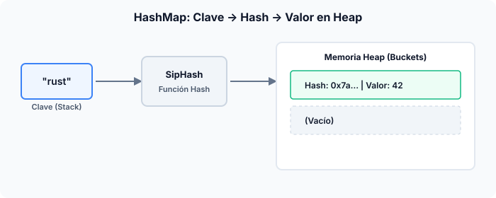


> 🟦 **CONEXIÓN TYPESCRIPT/JAVASCRIPT:** En TS/JS usas objetos literales (`{ [key: string]: number }`) o `Map<string, number>`. En Rust, `HashMap<K, V>` se comporta conceptualmente igual al `Map` de JavaScript, pero con tipado estricto y gestión de memoria sin recolector de basura (Garbage Collector).

---

### Creación e Inserción Básica

Para usar un `HashMap`, primero debemos importarlo desde la librería estándar (`std::collections::HashMap`).

```rust
use std::collections::HashMap;

fn main() {
    // Creamos un mapa mutable
    let mut puntuaciones = HashMap::new();

    // Insertamos claves y valores
    puntuaciones.insert(String::from("Azul"), 10);
    puntuaciones.insert(String::from("Rojo"), 50);

    // Acceso seguro con .get(), devuelve un Option<&V>
    let equipo = String::from("Azul");
    match puntuaciones.get(&equipo) {
        Some(&puntos) => println!("El equipo {equipo} tiene {puntos} puntos."),
        None => println!("El equipo no existe."),
    }
}
```

---

### La joya de la corona: La API `entry()` y `or_insert()`

Al contar elementos o actualizar valores condicionalmente, comprobar si una clave existe manualmente es lento y tedioso. Rust provee el método `entry()`.

`entry()` inspecciona si la clave existe y devuelve un `enum` llamado `Entry`:
* Si existe, nos da acceso mutable al valor existente.
* Si no existe, inserta un valor por defecto.


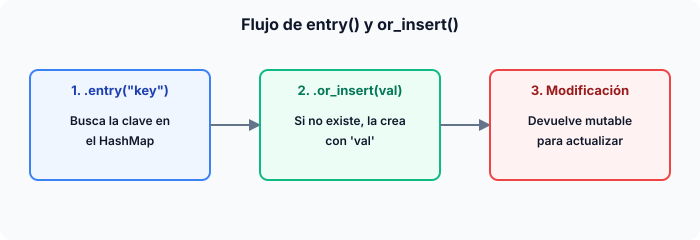


---

### Ejemplo práctico: Conteo de frecuencias de palabras

Este patrón se usa constantemente para contar ocurrencias de elementos en un texto:

```rust
use std::collections::HashMap;

fn main() {
    let texto = "hola mundo hola rust mundo hola";
    let mut frecuencias = HashMap::new();

    for palabra in texto.split_whitespace() {
        let contador = frecuencias.entry(palabra).or_insert(0);
        *contador += 1; // Incrementamos el valor al que apunta la referencia mutable
    }

    println!("{:?}", frecuencias);
    // Salida esperada (el orden puede variar): 
    // {"mundo": 2, "hola": 3, "rust": 1}
}
```

> 🟥 **FRENAZO DEL COMPILADOR:** Intentar usar una clave después de insertarla en el HashMap (si implementa `String` o tipos que hacen `Move`) te dará un error de propiedad (*ownership*).
> ```rust
> let mut mapa = HashMap::new();
> let clave = String::from("id");
> mapa.insert(clave, 1);
> // ¡Error! 'clave' se movió al HashMap. Ya no puedes usarla aquí:
> println!("{clave}"); 
> ```
> *Solución:* Pasa una referencia con `.clone()` si necesitas conservar la variable original, o usa tipos primitivos como `i32` o `&str` que implementan el trait `Copy`.

\pagebreak

# Capítulo 14: Manejo de Errores: Result<T, E> y el Operador '?'

> 🧠 **EN 10 SEGUNDOS (TDAH):** Rust no usa excepciones invisibles (`try/catch`). Los errores normales se manejan explícitamente con el `enum Result<T, E>`, que dice: *"O tengo el dato exitoso T, o tengo el error E"*. El operador `?` es un atajo limpio para propagar errores hacia arriba sin escribir código repetitivo.

---

## 1. El Choque de Trenes: Errores Irrecuperables vs Recuperables

En la programación tradicional, cuando algo falla (como intentar leer un archivo que no existe), lanzamos una excepción mágica que viaja por la pila de llamadas. En Rust, dividimos los problemas en dos mundos completamente separados:

1. **Irrecuperables (`panic!`):** Son bugs de programación catastróficos. Intentar acceder a un array fuera de sus límites o dividir por cero. El programa se detiene de inmediato para evitar corromper la memoria.
2. **Recuperables (`Result<T, E>`):** Son situaciones esperadas del mundo real. La red se cayó, el usuario escribió mal su contraseña, o el archivo no está en el disco. Rust te obliga a mirar el error a los ojos y decidir qué hacer.

```rust
fn conectar_base_datos(url: &str) -> Result<Conexion, ErrorRed> {
    if url.is_empty() {
        return Err(ErrorRed::UrlInvalida); // Error recuperable
    }
    
    // Si la máquina explota físicamente, usamos panic!
    if !servidor_encendido() {
        panic!("¡El servidor de base de datos se desintegró!");
    }

    Ok(Conexion { ... })
}
```

> 🟦 **CONEXIÓN TYPESCRIPT/JAVASCRIPT:** En TS/JS usas `try { ... } catch (e) { ... }` y asumes que cualquier función puede lanzar un error invisible. En Rust, **no hay excepciones**. El tipo de retorno de la función te avisa explícitamente si puede fallar mediante el `Result`.

---

## 2. Anatomía Visual de un `Result` y el Operador `?`

Imagina que el `Result` es una caja blindada que puede contener un regalo brillante (`Ok`) o una carta de desalojo (`Err`).


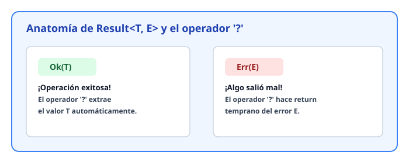


### El Poder del Operador `?`

El signo de interrogación (`?` colocado al final de una expresión) es un werolk (atajo mágico) que reemplaza cientos de líneas de código repetitivo de manejo de errores. 

Veamos cómo se lee: *"Intenta ejecutar esto. Si da `Ok`, extrae su valor interno y continúa. Si da `Err`, sal de esta función inmediatamente devolviendo ese error"*.

```rust
use std::fs::File;
use std::io::{self, Read};

fn leer_configuracion() -> Result<String, io::Error> {
    // Si File::open falla, retorna el error io::Error de inmediato
    let mut archivo = File::open("config.json")?;
    
    let mut contenido = String::new();
    
    // Si read_to_string falla, también propaga el error hacia arriba
    archivo.read_to_string(&mut contenido)?;

    Ok(contenido)
}
```

> 🟦 **CONEXIÓN TYPESCRIPT/JAVASCRIPT:** En JS moderno, el operador `?` se usa para encadenar propiedades nulas (`user?.name`). En Rust, el operador `?` equivale conceptualmente a hacer un `try/catch` implícito que hace `return err` si ocurre un fallo.

---

## 3. Las Muletas Peligrosas: `unwrap()` y `expect()`

A veces, escribir código robusto toma tiempo y solo quieres probar algo rápido. Rust te ofrece dos métodos para "forzar" la extracción de un `Result` sin manejar el error:

- **`unwrap()`**: Extrae el valor `Ok`. Si encuentra un `Err`, **hace pánico (`panic!`) y crashea el programa**.
- **`expect("mensaje")`**: Hace lo mismo que `unwrap()`, pero imprime un mensaje personalizado en la consola antes de morir.

```rust
fn main() {
    // PELIGRO: Si el archivo no existe, el programa explota.
    let archivo = File::open("inexistente.txt").unwrap();

    // MEJOR: Al menos dejamos una pista clara de por qué morimos.
    let configuracion = File::open("settings.toml")
        .expect("¡FATAL! No se encontró el archivo de configuración principal.");
}
```

> 🟥 **FRENAZO DEL COMPILADOR:**
> Usar `unwrap()` en código de producción es una mala práctica mal vista en la comunidad de Rust. Si dejas un `unwrap()` suelto, el compilador no te impedirá compilar, pero tu aplicación se derrumbará ante el primer imprevisto real.
> 
> **Regla de oro:** Reserva `unwrap()` y `expect()` exclusivamente para **prototipos rápidos**, **tests automatizados**, o cuando estás **100% seguro** de que un estado es imposible de alcanzar (por ejemplo, al compilar una expresión regular estática).

---

## 4. Combinando `Result` con Pattern Matching (`match`)

Cuando el error no debe propagarse, sino resolverse localmente, el `match` es tu mejor aliado. Puedes inspeccionar ambas variantes con precisión quirúrgica:

```rust
use std::fs::File;

fn main() {
    let resultado = File::open("datos.csv");

    let _archivo = match resultado {
        Ok(f) => {
            println!("¡Archivo abierto con éxito!");
            f
        }
        Err(e) => {
            println!("No se pudo abrir el archivo por esta razón: {e}");
            // Creamos un archivo por defecto o manejamos la situación
            return;
        }
    };
}
```

Con este dominio del `Result` y el operador `?`, ya no dependes de la suerte ni de bloques `try/catch` ocultos. Tus programas en Rust son transparentes, predecibles y seguros frente a cualquier imprevisto del mundo real.

\pagebreak

# Capítulo 15: Módulos y Crates: Arquitectura de Proyectos

> 🧠 **EN 10 SEGUNDOS (TDAH):** Los crates son tus bibliotecas compilables. Los módulos (`mod`) son carpetas y archivos virtuales dentro del crate que organizan tu código como un armario ordenado, controlando quién puede ver qué con la regla de oro: **todo es privado por defecto**.

---

## 1. El Árbol de Módulos: Tu Código como un Mapa Mental

Imagina tu proyecto de Rust como un edificio de oficinas. Cada archivo y cada bloque `mod` es una habitación. El compilador empieza a buscar siempre desde la recepción principal: el archivo raíz (`main.rs` o `lib.rs`).

```rust
// main.rs o lib.rs
mod red {
    pub fn conectar() {
        println!("Conectando al servidor...");
    }
}

fn main() {
    red::conectar(); // Llamando a una función dentro del módulo red
}
```

Para visualizar cómo Rust conecta estos espacios lógicamente, mira el siguiente árbol jerárquico:


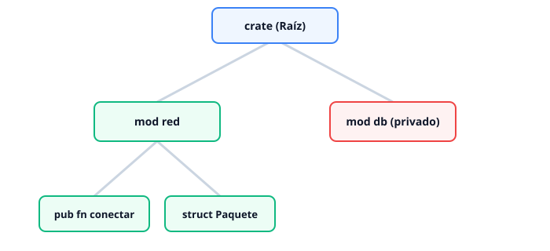


> 🟦 **CONEXIÓN TYPESCRIPT/JAVASCRIPT:** En TS/JS usas `import { algo } from './archivo'` creando rutas basadas en archivos físicos de forma muy flexible. Rust separa los archivos físicos de la estructura lógica: defines qué existe con la palabra `mod` y controlas el acceso estrictamente por jerarquía de padres e hijos.

---

## 2. Privacidad por Defecto y el Poder de `pub`

En Rust, **todo es privado por defecto**. Si creas una función, un struct o un módulo, sus hermanos y el mundo exterior no pueden verlo a menos que abras explícitamente la puerta con `pub`.

```rust
mod cafeteria {
    // Privado por defecto: solo visible dentro de 'cafeteria'
    fn calentar_agua() {
        println!("Calentando agua...");
    }

    // Público: visible para cualquiera que alcance este módulo
    pub fn servir_cafe() {
        calentar_agua(); // Permitido internamente
        println!("Aquí tienes tu café.");
    }
}

fn main() {
    cafeteria::servir_cafe(); // Funciona perfecto
    // cafeteria::calentar_agua(); // ERROR DE COMPILACIÓN: es privado
}
```

> 🟥 **FRENAZO DEL COMPILADOR:** Si intentas acceder a un campo de un struct público cuyos campos no son públicos, Rust te detendrá en seco:
> ```text
> error[E0616]: field `password` of struct `User` is private
>   --> src/main.rs:10:20
>    |
> 10 |     let p = user.password;
>    |                  ^^^^^^^^ private field
> ```
> **La solución:** Debes marcar explícitamente el campo como `pub struct User { pub password: String }` o proveer un método getter público (`pub fn password(&self) -> &str`).

---

## 3. Navegando el Laberinto: Rutas Absolutas y Relativas

Para encontrar código dentro de tu crate, puedes usar dos tipos de rutas:

1. **Rutas Absolutas:** Comienzan desde la raíz del crate usando la palabra clave `crate::`. Son ideales para saltar desde submódulos profundos directamente a servicios globales.
2. **Rutas Relativas:** Comienzan desde el módulo actual usando `self`, el nombre del hijo, o `super::` para subir un nivel hacia el padre (como el `../` en rutas de terminal).

```rust
fn calentar_agua() {}

mod cocina {
    pub fn preparar_desayuno() {
        // Ruta absoluta desde la raíz del crate
        crate::calentar_agua();

        // Ruta relativa subiendo al padre (si hubiera algo arriba)
        // super::otra_funcion();

        // Ruta relativa usando self (mismo nivel)
        self::freir_huevos();
    }

    fn freir_huevos() {
        println!("Fritando huevos...");
    }
}
```

---

## 4. Reexportación Limpia con `pub use`

A veces, la estructura interna de tus carpetas es compleja y profunda, pero quieres ofrecer una interfaz simple y directa a quienes usen tu librería. Aquí es donde entra `pub use`.

Te permite exponer en la superficie de tu módulo funciones o structs que están enterrados tres niveles más abajo.

```rust
mod backend {
    pub mod auth {
        pub fn verificar_token(token: &str) -> bool {
            token == "secreto_valido"
        }
    }
}

// Reexportamos la función para que parezca que está directamente en el módulo raíz
pub use backend::auth::verificar_token;

fn main() {
    // El usuario final llama directamente a la función limpia
    let valido = verificar_token("secreto_valido");
    assert!(valido);
}
```

Veamos visualmente cómo `pub use` crea un atajo directo sin alterar tu orden interno:


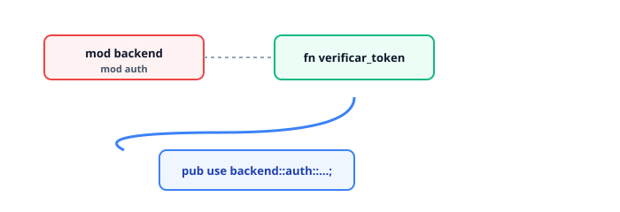


---

## Resumen del Capítulo

- **Árbol de Módulos:** Organiza tu código lógicamente imitando la estructura de directorios o mediante bloques `mod`.
- **Privacidad:** Todo es privado por defecto. Usa `pub` para abrir visibilidad de forma consciente.
- **Rutas:** `crate::` para ir a la raíz absoluta, `super::` para subir un nivel en el árbol.
- **`pub use`:** La navaja suiza para aplanar APIs complejas y ofrecer accesos directos elegantes a tus usuarios.

\pagebreak

# Capítulo 16: Genéricos y Traits: Interfaces con Superpoderes

> 🧠 **EN 10 SEGUNDOS (TDAH):** Los genéricos permiten escribir código reutilizable para cualquier tipo de dato, mientras que los *traits* son contratos que obligan a un tipo a tener ciertas habilidades. El compilador verifica todo esto **antes** de ejecutar el programa.

---

## 1. Genéricos: Escribe Código una Sola Vez

En programación, a menudo necesitamos realizar la misma lógica para diferentes tipos de datos. Copiar y pegar código es el enemigo. Los genéricos nos permiten usar comodines (como `<T>`) para decir: *"esta función o struct funciona para cualquier tipo"*.

```rust
// Una función genérica que acepta cualquier tipo T que soporte la comparación
fn mayor<T: PartialOrd>(a: T, b: T) -> T {
    if a > b { a } else { b }
}

fn main() {
    println!("{}", mayor(10, 20));       // Funciona con i32
    println!("{}", mayor(3.14, 2.71));   // Funciona con f64
}
```

> 🟦 **CONEXIÓN TYPESCRIPT/JAVASCRIPT:** En TypeScript usas funciones genéricas como `function mayor<T>(a: T, b: T): T`. La gran diferencia es que TypeScript borra los genéricos al compilar (borrado de tipos). En Rust, el compilador **examina cada uso real** y genera una versión de código nativo optimizada e hiper-rápida para cada tipo específico (*monomorfización*).

---

## 2. Visualizando los Genéricos y la Memoria

El siguiente diagrama muestra cómo un único molde genérico se convierte en código máquina especializado para enteros y decimales sin perder rendimiento.


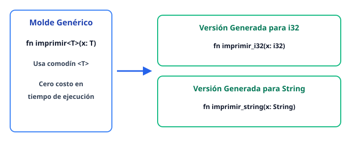


---

## 3. Traits: Contratos de Comportamiento

Un `trait` define un conjunto de métodos que un tipo debe implementar. Es muy similar a una `interface` en TypeScript o una interfaz en Java o C#.

Imagina que creas un videojuego y quieres que tanto un `Guerrero` como un `Mago` puedan emitir un grito de batalla.

```rust
// Definimos el contrato (trait)
trait Gritar {
    fn gritar(&self) -> String;
}

struct Guerrero;
struct Mago;

// Implementamos el trait para el Guerrero
impl Gritar for Guerrero {
    fn gritar(&self) -> String {
        String::from("¡Por la espada y el honor!")
    }
}

// Implementamos el trait para el Mago
impl Gritar for Mago {
    fn gritar(&self) -> String {
        String::from("¡Que la magia arda!")
    }
}

fn hacerle_gritar<T: Gritar>(item: T) {
    println!("{}", item.ritar());
}
```

---

## 4. Trait Bounds y Derivación Automática

A veces, al usar genéricos, necesitamos restringir qué tipos son aceptados. Esto se hace mediante **trait bounds** (límites de trait), usando dos sintaxis principales:

```rust
// Sintaxis con Trait Bound clásico
fn mostrar_elemento<T: std::fmt::Debug>(item: T) {
    println!("{:?}", item);
}

// Sintaxis con 'impl Trait' (más limpia para argumentos simples)
fn mostrar_elemento_corto(item: impl std::fmt::Debug) {
    println!("{:?}", item);
}
```

### Derivación Automática (`#[derive(...)]`)
Rust te evita escribir código repetitivo para comportamientos estándar comunes mediante macros de derivación. Los más vitales en el día a día son:

- **`Debug`**: Permite imprimir el struct usando la sintaxis `{:?}` para depurar.
- **`Clone`**: Permite duplicar el dato explícitamente con `.clone()`.
- **`PartialEq`**: Permite comparar dos instancias usando operadores de igualdad `==`.

```rust
#[derive(Debug, Clone, PartialEq)]
struct Usuario {
    id: u64,
    nombre: String,
}

fn main() {
    let u1 = Usuario { id: 1, nombre: String::from("Ada") };
    let u2 = u1.clone(); // Gracias a #[derive(Clone)]

    if u1 == u2 { // Gracias a #[derive(PartialEq)]
        println!("¡Son exactamente iguales!");
    }
    
    println!("{:?}", u1); // Gracias a #[derive(Debug)]
}
```

> 🟥 **FRENAZO DEL COMPILADOR:**
> Intenta hacer esto sin el macro de derivación:
> ```rust
> struct Secreto { codigo: u32 }
> 
> fn main() {
>     let s = Secreto { codigo: 42 };
>     println!("{:?}", s); // ERROR DE COMPILACIÓN
> }
> ```
> El compilador te dirá furioso: *``Secreto` doesn't implement `Debug*. Te explicará amablemente que Rust no adivina cómo quieres mostrar tu estructura y te sugerirá agregar `#[derive(Debug)]` en la línea superior. Cero sorpresas en producción.
```
```


\pagebreak

# Capítulo 17: Lifetimes: El Tiempo de Vida de las Referencias

> 🧠 **EN 10 SEGUNDOS (TDAH):** Los *lifetimes* son etiquetas invisibles que el compilador usa para asegurarse de que una referencia nunca viva más tiempo que el dato al que apunta. ¡Adiós a los punteros colgantes (dangling pointers)!

---

## 1. El Problema: ¿Cuánto vive una referencia?

En Rust, cuando prestas un valor usando una referencia (`&`), el compilador necesita saber con absoluta certeza cuánto tiempo será válido ese préstamo. Si el propietario original del dato muere (sale de su scope), la referencia se vuelve peligrosa.

Imagina que alquilas un apartamento. El dueño del apartamento decide demolerlo. Si tú sigues adentro, estás usando un recurso que ya no existe. En programación, esto se llama **puntero colgante**.

> 🟦 **CONEXIÓN TYPESCRIPT/JAVASCRIPT:** En JS/TS existe el *Garbage Collector*. Si un objeto sigue referenciado, el recolector no lo borra. Si ya no se usa, lo limpia tarde o temprano. En Rust **no hay recolector de basura**. El compilador previene estos desastres analizando el tiempo de vida en tiempo de compilación.

---

## 2. La Sintaxis de los Lifetimes (`'a`)

Para decirle al compilador cómo se relacionan los tiempos de vida de diferentes referencias, usamos anotaciones de lifetime. Su símbolo es una comilla simple seguida de una letra minúscula, por lo general `'a`.

Observa este diagrama SVG que ilustra cómo una referencia no puede sobrevivir a su propietario en el Stack:


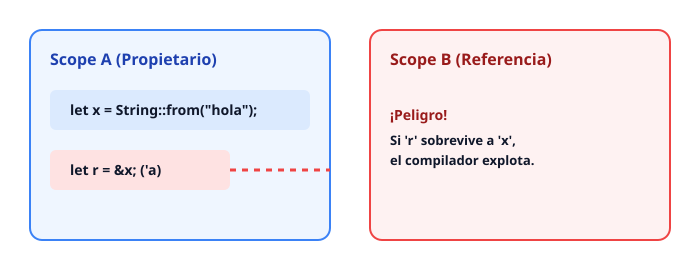


Cuando creas una función que toma prestados dos strings y devuelve el más largo, el compilador no sabe si devolverá el primero o el segundo. Necesita que le asegures que la referencia resultante vivirá tanto como el menor de los dos inputs.

```rust
// Anotamos 'a para vincular los tiempos de vida
fn mas_largo<'a>(s1: &'a str, s2: &'a str) -> &'a str {
    if s1.len() > s2.len() {
        s1
    } else {
        s2
    }
}
```

> 🟥 **FRENAZO DEL COMPILADOR:**
> ```text
> error[E0106]: missing lifetime specifier
>   --> src/main.rs:1:33
>    |
> 1  | fn mas_largo(s1: &str, s2: &str) -> &str {
>    |                  ----      ----     ^ expected named lifetime parameter
> ```
> **Por qué ocurre:** Rust te obliga a poner una anotación de lifetime cuando devuelves una referencia, porque no sabe a qué parámetro pertenecerá el dato retornado en tiempo de ejecución.

---

## 3. Reglas de Elisión (El compilador hace el trabajo sucio)

Escribir `'a` en todas partes sería agotador. Por suerte, los creadores de Rust diseñaron **reglas de elisión de lifetimes**. El compilador aplica tres reglas automáticas para deducir los lifetimes sin que tengas que escribirlos:

1. Cada parámetro de referencia recibe su propio parámetro de lifetime. (Ej: `fn foo(s1: &str, s2: &str)` se convierte en `fn foo<'a, 'b>(s1: &'a str, s2: &'b str)`).
2. Si hay exactamente un parámetro de entrada con referencia, su lifetime se asigna a *todos* los outputs.
3. Si hay múltiples parámetros de entrada, pero uno de ellos es `&self` o `&mut self` (en métodos de structs), el lifetime de `self` se asigna a todos los outputs.

Si el compilador aplica estas reglas y aún quedan dudas, te pedirá amablemente que escribas las anotaciones de forma explícita.

---

## Resumen del Capítulo

- Los **lifetimes** previenen punteros colgantes garantizando que una referencia nunca viva más que su recurso.
- La sintaxis usa comillas y una letra (ej. `'a`), indicando que los datos comparten el mismo periodo de validez.
- El compilador calcula muchos lifetimes automáticamente gracias a las **reglas de elisión**, por lo que solo debes intervenir en firmas de funciones complejas.

\pagebreak

# Capítulo 18: Programación Funcional: Closures e Iteradores

> 🧠 **EN 10 SEGUNDOS (TDAH):** Los closures son bloques de código que recuerdan su entorno, y los iteradores son tuberías eficientes para procesar datos sin crear copias innecesarias. En Rust, todo esto es seguro porque el compilador rastrea exactamente cómo prestas y consumes tus variables.

---

## 1. Closures: Funciones Anónimas con Memoria

Un closure es una función que puedes guardar en una variable, pasar como argumento y que tiene superpoderes: puede capturar variables del ámbito que la rodea.

A diferencia de las funciones normales declaradas con `fn`, los closures no requieren que declares los tipos de sus parámetros (el compilador los deduce) y usan barras verticales `|` para sus argumentos.

> 🟦 **CONEXIÓN TYPESCRIPT/JAVASCRIPT:**
> En JS/TS usas funciones flecha: `const sumar = (a, b) => a + b;`. 
> En Rust, escribes: `let sumar = |a, b| a + b;`. Sintácticamente son primas hermanas, pero por debajo Rust hace algo radicalmente distinto con la memoria.

### Los Tres Tratos de la Captura: Fn, FnMut y FnOnce

En JavaScript, si una función flecha accede a una variable externa, simplemente la lee o la modifica y el recolector de basura se encarga del resto. En Rust, cada closure implementa uno o más *traits* especiales basados en *cómo* captura su entorno:

1. **`FnOnce`**: Consume las variables que captura (las mueve al closure). Solo se puede ejecutar **una vez** porque destruye su entorno.
2. **`FnMut`**: Toma prestadas las variables del entorno **de forma mutable** (`&mut`). Puede modificar el entorno y ejecutarse varias veces.
3. **`Fn`**: Toma prestadas las variables del entorno **de forma inmutable** (`&`). Puede ejecutarse muchas veces en paralelo sin alterar nada.

```rust
fn main3() {
    let nombre = String::from("Rust");

    // Este closure toma la propiedad de 'nombre' (FnOnce)
    let consumir = || {
        let _propietario = nombre; 
    };

    consumir();
    // println!("{}", nombre); // ERROR DE COMPILACIÓN: 'nombre' ya no vive aquí.
}
```

> 🟥 **FRENAZO DEL COMPILADOR:**
> Si intentas usar un closure después de que se ha tragado una variable con `FnOnce`, el compilador te gritará que usaste un valor movido (*use of moved value*). Rust te protege de usar datos huérfanos.

---

## 2. Visualizando Closures y su Entorno

El siguiente diagrama muestra cómo un closure atrapa variables del stack dependiendo de su política de acceso (`Fn`, `FnMut` o `FnOnce`).


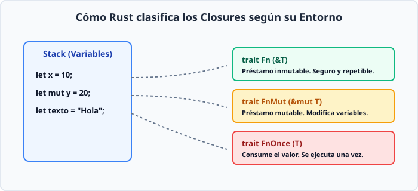


---

## 3. Iteradores: Cero Coste y Rendimiento Brutal

En muchos lenguajes, usar métodos como `.map()` o `.filter()` crea nuevos arreglos en memoria dinámicamente, penalizando el rendimiento. 

En Rust, **los iteradores son perezosos (lazy)**. No hacen absolutamente nada hasta que los consumes con un método como `.collect()` o `.forEach()`. El compilador optimiza estas cadenas de iteradores hasta convertirlas en bucles `for` nativos ultrarrápidos (abstracción de coste cero).

### Los Tres Reyes del Estilo Funcional

1. **`map`**: Transforma cada elemento aplicando un closure.
2. **`filter`**: Filtra elementos devolviendo un booleano basado en una condición.
3. **`fold`**: Reduce toda una colección a un solo valor acumulado (equivalente a `reduce` en JS).

```rust
fn main() {
    let numeros = vec![1, 2, 3, 4, 5];

    // Cadena funcional de iteradores
    let suma_cuadrados: i32 = numeros
        .iter()                    // Creamos un iterador de referencias (&i32)
        .map(|&x| x * x)           // Elevamos al cuadrado cada número
        .filter(|&x| x > 10)       // Filtramos los mayores a 10
        .fold(0, |acum, val| acum + val); // Sumamos todo acumulando en '0'

    println!("Resultado final: {}", suma_cuadrados); // 16 (9 + 25 = 34... espera: 3^2=9, 4^2=16, 5^2=25. >10 son 16 y 25 -> 41)
}
```

---

## 4. Anatomía Visual de un Pipeline de Iteradores

Observa cómo los datos fluyen perezosamente a través de adaptadores puramente lógicos antes de ser consumidos en una única pasada optimizada.


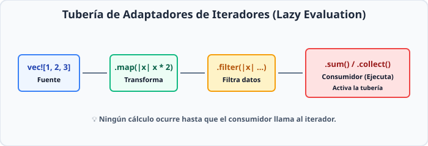


---

## 5. Resumen del Capítulo

* Los **closures** en Rust son funciones anónimas capaces de capturar su entorno de tres formas estrictas: `Fn`, `FnMut` y `FnOnce`.
* El sistema de ownership de Rust analiza con precisión milimétrica si un closure toma prestado o roba las variables externas.
* Los **iteradores** son perezosos (*lazy*): no ejecutan operaciones hasta que un consumidor los activa.
* Gracias al modelo de optimización de LLVM en Rust, el código funcional con iteradores compila siendo tan rápido o más que un bucle `for` manual escrito en C.

\pagebreak

# Capítulo 19: Punteros Inteligentes: Box, Rc y RefCell

> 🧠 **EN 10 SEGUNDOS (TDAH):** Los punteros inteligentes en Rust son structs que manejan datos en la memoria y añaden superpoderes (como saber cuándo borrar los datos automáticamente o permitir múltiples dueños). Olvídate de hacer `free` o `delete` manual.

En Rust, las reglas de propiedad y el *Borrow Checker* son muy estrictas. Por defecto, cada valor tiene un único dueño y los datos viven en el *Stack* (Pila). 

Pero la vida real es compleja: a veces necesitas datos gigantescos, estructuras recursivas, o que varias partes de tu programa posean el mismo dato. Aquí es donde entran los **Punteros Inteligentes** (*Smart Pointers*).

---

## 1. Box&lt;T&gt;: Tu boleto al Heap

Un `Box<T>` te permite almacenar datos en el *Heap* (Montículo) en lugar del *Stack*. ¿Por qué harías esto?

1. Cuando tienes un tipo cuyo tamaño no se conoce en tiempo de compilación (como una estructura recursiva, por ejemplo, un nodo de árbol o lista enlazada).
2. Cuando quieres transferir la propiedad de una cantidad masiva de datos sin copiar los datos reales, solo moviendo su dirección de memoria (el puntero).

```rust
// Una estructura recursiva necesita un Box, de lo contrario
// el compilador no sabría cuánto espacio reservar en el Stack.
#[allow(dead_code)]
enum Lista {
    Nodo(i32, Box<Lista>),
    Vacio,
}

fn main() {
    // Creamos una lista en el Heap usando Box
    let mi_lista = Lista::Nodo(
        1, 
        Box::new(Lista::Nodo(2, Box::new(Lista::Vacio)))
    );
    
    println!("Lista creada exitosamente en el Heap.");
}
```

> 🟦 **CONEXIÓN TYPESCRIPT/JAVASCRIPT:** En JS/TS, **todos** los objetos y arrays viven automáticamente en el *Heap* y el recolector de basura (*Garbage Collector*) se encarga de ellos. `Box<T>` en Rust es como crear un objeto, pero con una diferencia clave: Rust sabe exactamente en qué línea de código morirá y liberará la memoria de inmediato, sin pausas de recolección.

---

## 2. Visualizando Box&lt;T&gt;: Stack vs Heap


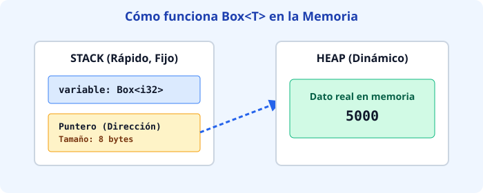


---

## 3. Rc&lt;T&gt;: Propiedad Múltiple en un Solo Hilo

Normalmente, Rust te prohíbe tener más de un dueño para el mismo valor. ¿Qué pasa si construyes un grafo donde varios nodos apuntan al mismo hijo? 

`Rc<T>` significa **Reference Counted** (Conteo de Referencias). Mantiene un contador de cuántos propietarios tiene el dato. Cada vez que clonas el `Rc`, el contador sube en 1. Cuando un dueño sale de ámbito, el contador baja. Cuando llega a cero, el dato se destruye automáticamente.

> ⚠️ **Aviso importante:** `Rc<T>` **no es seguro para hilos** (*not thread-safe*). Si necesitas compartir datos entre múltiples hilos de CPU, usarás `Arc<T>` (Atomic Reference Counted).

```rust
use std::rc::Rc;

fn main() {
    // Creamos un dato compartido dentro de un Rc
    let sol = Rc::new(String::from("Sol de verano"));
    
    // Clonar el Rc NO clona el String, solo incrementa el contador de referencias
    let planetoide_1 = Rc::clone(&sol);
    let planetoide_2 = Rc::clone(&sol);

    println!("Referencias activas: {}", Rc::strong_count(&sol)); // Muestra 3
    
    // Al salir de main, planetoide_2, planetoide_1 y sol se destruyen.
    // El string se libera cuando el contador llega a 0.
}
```

> 🟥 **FRENAZO DEL COMPILADOR:** Si intentas enviar un `Rc<T>` a otro hilo usando `std::thread::spawn`, Rust te arrojará un error masivo diciendo que `Rc` no implementa el trait `Send`. El compilador te protege de corrupciones de memoria concurrentes. Usa `Arc<T>` para multihilo.

---

## 4. RefCell&lt;T&gt; y Mutabilidad Interior

Las reglas de Rust dicen: *puedes tener múltiples referencias inmutables (`&T`) O una sola referencia mutable (`&mut T`), pero nunca ambas a la vez.* Esto se valida en **tiempo de compilación**.

Pero a veces tu lógica necesita ser mutable por fuera, aunque parezca inmutable por dentro. Aquí entra `RefCell<T>`.

`RefCell<T>` traslada la comprobación de reglas de préstamo del **tiempo de compilación** al **tiempo de ejecución** (*runtime*). Si rompes las reglas, tu programa entrará en pánico (*panic*) y se cerrará en lugar de compilar mal.

### El patrón definitivo: `Rc<RefCell<T>>`
Combinar ambos punteros inteligentes es una técnica muy común en Rust para crear estructuras de datos complejas (como grafos o árboles con referencias cruzadas):

```rust
use std::rc::Rc;
use std::cell::RefCell;

fn main() {
    // Un dato compartido (Rc) que además permite mutabilidad interior (RefCell)
    let configuracion = Rc::new(RefCell::new(42));

    // Dos dueños diferentes pueden modificar el mismo valor subyacente
    let ref_cliente_a = Rc::clone(&configuracion);
    let ref_cliente_b = Rc::clone(&configuracion);

    // Mutamos a través del cliente A
    *ref_cliente_a.borrow_mut() = 100;

    // Leemos a través del cliente B
    println!("Nueva configuración vista por B: {}", *ref_cliente_b.borrow());
}
```

---

## Resumen del Arsenal de Punteros

| Puntero Inteligente | ¿Dónde vive? | ¿Cuántos dueños? | ¿Cuándo se valida? | Caso de uso típico |
| :--- | :--- | :--- | :--- | :--- |
| **`Box<T>`** | Heap | 1 solo | Compilación | Datos recursivos o grandes |
| **`Rc<T>`** | Heap | Múltiples (Un hilo) | Compilación | Grafos, árboles, compartir lectura |
| **`RefCell<T>`** | Stack / Heap | 1 (con mutabilidad interior) | **Ejecución** | Patrones de diseño flexibles / Mocking |

\pagebreak

# Capítulo 20: Concurrencia sin Miedo: Hilos y Canales

> 🧠 **EN 10 SEGUNDOS (TDAH):** Rust te deja correr código en paralelo (varias cosas a la vez) bloqueando los peores bugs antes de compilar. Si intentas compartir datos sin protección, el compilador te grita. Punto.

---

## 1. El Caos del Estado Compartido vs Concurrencia Segura

En la programación tradicional, correr múltiples hilos (*threads*) en paralelo es una receta para el desastre: dos hilos modifican el mismo espacio de memoria al mismo tiempo y ¡boom!, corrupción de datos o comportamientos raros imposibles de replicar.

Rust elimina el 100% de las *Data Races* (carreras de datos) directamente en su sistema de tipos y ownership.

> 🟦 **CONEXIÓN TYPESCRIPT/JAVASCRIPT:** En Node.js vives en un mundo de un solo hilo con un *Event Loop* asíncrono. Si quieres paralelismo real, usas `Worker Threads` y pasas mensajes mediante `postMessage()`. Rust te da hilos nativos del sistema operativo de verdad, pero con un guardián incorruptible (el compilador).

---

## 2. Creando Hilos con `std::thread::spawn` y la palabra clave `move`

Para crear un hilo nuevo en Rust usamos `thread::spawn`. Le pasamos un closure con el código que queremos ejecutar en segundo plano.

```rust
use std::thread;
use std::time::Duration;

fn main() {
    let handle = thread::spawn(|| {
        for i in 1..5 {
            println!("Hola desde el hilo secundario: {}", i);
            thread::sleep(Duration::from_millis(100));
        }
    });

    for i in 1..3 {
        println!("Hola desde el hilo principal: {}", i);
        thread::sleep(Duration::from_millis(100));
    }

    // Esperamos a que el hilo secundario termine
    handle.join().unwrap();
}
```

¿Qué pasa si el hilo secundario necesita usar una variable que fue creada en el hilo principal? Por defecto, Rust intentará hacer un préstamo (*borrow*), pero el hilo principal podría morir antes de que el secundario use el dato.

La solución es usar la palabra clave `move` para transferir la propiedad (*ownership*) al nuevo hilo:

```rust
use std::thread;

fn main() {
    let mensaje = String::from("¡Hola desde el hilo con ownership!");

    // 'move' fuerza a que este hilo sea dueño absoluto de 'mensaje'
    let handle = thread::spawn(move || {
        println!("{}", mensaje);
    });

    handle.join().unwrap();
    // println!("{}", mensaje); // ERROR: 'mensaje' ya fue movido al otro hilo
}
```

---

## 3. Ilustración Visual: El Ciclo de Vida y el Movimiento (`move`)


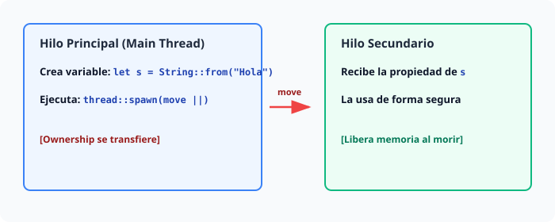


---

## 4. Canales de Mensajes: MPSC (Multi-Producer, Single-Consumer)

En lugar de compartir datos directamente, la filosofía recomendada en Rust es: *"No compartas memoria comunicándote mediante variables; comunícate compartiendo memoria mediante mensajes"*.

Usamos un canal `mpsc` (*Multiple Producer, Single Consumer*): muchos hilos pueden enviar datos, pero uno solo los recibe.

```rust
use std::sync::mpsc;
use std::thread;
use std::time::Duration;

fn main() {
    // Creamos el canal: tx (transmitter), rx (receiver)
    let (tx, rx) = mpsc::channel();

    let tx1 = tx.clone(); // Clonamos el emisor para el segundo hilo

    // Hilo 1
    thread::spawn(move || {
        let vals = vec![String::from("hi"), String::from("from"), String::from("thread 1")];
        for val in vals {
            tx1.send(val).unwrap();
            thread::sleep(Duration::from_millis(200));
        }
    });

    // Hilo 2
    thread::spawn(move || {
        let vals = vec![String::from("saludos"), String::from("desde"), String::from("hilo 2")];
        for val in vals {
            tx.send(val).unwrap();
            thread::sleep(Duration::from_millis(200));
        }
    });

    // Hilo principal recibiendo los mensajes bloqueándose hasta que llegan
    for recibido in rx {
        println!("Mensaje got: {}", recibido);
    }
}
```

> 🟦 **CONEXIÓN TYPESCRIPT/JAVASCRIPT:** En JS, para pasar mensajes entre Web Workers, usas `worker.postMessage()` y escuchas eventos `on('message')`. El canal MPSC de Rust hace exactamente lo mismo, pero tipado fuertemente de extremo a extremo, garantizando que el receptor sepa exactamente qué tipo de estructura de datos va a leer.

---

## 5. Estado Compartido Seguro: `Mutex<T>` y `Arc<T>`

A veces necesitas que múltiples hilos modifiquen exactamente el mismo dato en memoria. Para lograrlo de forma segura usamos dos herramientas combinadas:

1. **`Mutex<T>` (Mutual Exclusion):** Permite que un solo hilo acceda al dato a la vez. Bloquea a los demás hasta que libera el recurso.
2. **`Arc<T>` (Atomic Reference Counted):** Un contador de referencias atómico y seguro para hilos que permite que múltiples dueños apunten al mismo `Mutex` en diferentes hilos.

```rust
use std::sync::{Arc, Mutex};
use std::thread;

fn main() {
    // Envolvemos el contador en un Mutex y luego en un Arc
    let contador = Arc::new(Mutex::new(0));
    let mut handles = vec![];

    for _ in 0..10 {
        let contador_clon = Arc::clone(&contador);
        let handle = thread::spawn(move || {
            // .lock().unwrap() adquiere el permiso de escritura de forma segura
            let mut num = contador_clon.lock().unwrap();
            *num += 1;
        });
        handles.push(handle);
    }

    for handle in handles {
        handle.join().unwrap();
    }

    println!("Resultado final: {}", *contador.lock().unwrap());
}
```

> 🟥 **FRENAZO DEL COMPILADOR:**
> Si intentas usar un `Rc<T>` normal en lugar de un `Arc<T>` para compartir datos entre hilos, el compilador te detendrá inmediatamente:
> ```text
> error[E0277]: `Rc<Mutex<i32>>` cannot be sent between threads safely
>   --> src/main.rs:8:36
>   |
> 8 |         let handle = thread::spawn(move || {
>   |                      ^^^^^^^^^^^^^ `Rc<Mutex<i32>>` cannot be sent between threads safely
> ```
> **¿Por qué?** `Rc` no es seguro para hilos porque su conteo interno de referencias no usa operaciones atómicas de CPU, lo que rompería la memoria en entornos multihilo. Rust te obliga a usar `Arc` (*Atomic Rc*).

---

## 6. Ilustración Visual: Arc y Mutex Trabajando Juntos


---

## Resumen del Capítulo
- Los hilos en Rust se lanzan con `thread::spawn`.
- La palabra clave `move` transfiere la propiedad de las variables del hilo principal al secundario.
- Los canales `mpsc` permiten enviar mensajes entre hilos de forma ordenada.
- La combinación de `Arc<T>` y `Mutex<T>` te permite compartir y modificar estado de manera segura sin carreras de datos.

\pagebreak

# Capítulo 21: Proyecto Maestro: Servidor Web Concurrente

> 🧠 **EN 10 SEGUNDOS (TDAH):** Construiremos un servidor web multihilo desde cero. Usaremos un `TcpListener` para escuchar conexiones, peticiones HTTP básicas y un `ThreadPool` personalizado para manejar múltiples usuarios en paralelo sin fundir la CPU.

---

El momento de la verdad ha llegado. Vamos a juntar todo lo que has aprendido sobre ownership, concurrencia, canales (`channels`) y closures para construir un servidor web funcional de alto rendimiento.

> 🟦 **CONEXIÓN TYPESCRIPT/JAVASCRIPT:** En Node.js, creas un servidor HTTP con `http.createServer()` que maneja eventos de forma asíncrona en un solo hilo (event loop). En Rust, el enfoque por defecto es multihilo real: cada petición o lote de peticiones se reparte de forma segura entre varios hilos de CPU usando memoria totalmente controlada.

---

## 1. El Ciclo de Vida del Servidor y el `TcpListener`

Un servidor web es básicamente un bucle infinito que abre los oídos en un puerto de red, espera a que alguien toque la puerta, lee el mensaje HTTP y devuelve una respuesta.

```rust
use std::net::TcpListener;
use std::io::{Read, Write};

fn main() -> std::io::Result<()> {
    // Abrimos el puerto 7878 en localhost
    let listener = TcpListener::bind("127.0.0.1:7878")?;
    println!("Servidor activo en http://127.0.0.1:7878");

    for stream in listener.incoming() {
        let mut stream = stream?;
        handle_connection(&mut stream)?;
    }

    Ok(())
}

fn handle_connection(stream: &mut std::net::TcpStream) -> std::io::Result<()> {
    let mut buffer = [0; 1024];
    stream.read(&mut buffer)?;

    // Respuesta HTTP básica en texto plano
    let response = "HTTP/1.1 200 OK\r\n\r\n¡Hola desde Rust sin Dolor!";
    stream.write_all(response.as_bytes())?;
    stream.flush()
}
```

Este código funciona, pero tiene un problema grave: es **secuencial**. Si un cliente se conecta y tarda 10 segundos en recibir la respuesta, el siguiente cliente se queda esperando congelado. Necesitamos un `ThreadPool`.

---

## 2. Diagrama del ThreadPool y Canales

Para evitar crear un hilo nuevo por cada petición (lo cual satura el sistema operativo), creamos un grupo fijo de hilos trabajadores (*workers*) que toman tareas de una cola compartida.


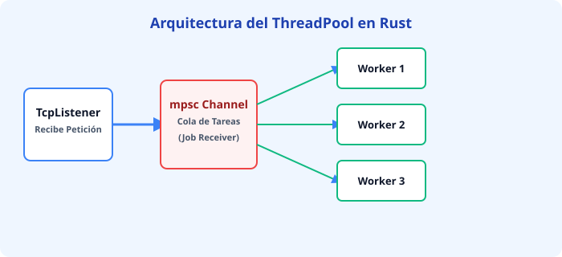


---

## 3. Construyendo el `ThreadPool`

Vamos a empaquetar la lógica concurrente en una estructura limpia y reutilizable.

```rust
use std::thread;
use std::sync::{mpsc, Arc, Mutex};

pub struct ThreadPool {
    workers: Vec<Worker>,
    sender: mpsc::Sender<Job>,
}

type Job = Box<dyn FnOnce() + Send + 'static>;

impl ThreadPool {
    /// Crea un nuevo ThreadPool con un número determinado de hilos.
    pub fn new(size: usize) -> ThreadPool {
        assert!(size > 0);

        let (sender, receiver) = mpsc::channel();
        let receiver = Arc::new(Mutex::new(receiver));

        let mut workers = Vec::with_capacity(size);

        for id in 0..size {
            workers.push(Worker::new(id, Arc::clone(&receiver)));
        }

        ThreadPool { workers, sender }
    }

    /// Envía una tarea al pool para que la ejecute un hilo disponible.
    pub fn execute<F>(&self, f: F)
    where
        F: FnOnce() + Send + 'static,
    {
        let job = Box::new(f);
        self.sender.send(job).unwrap();
    }
}

struct Worker {
    id: usize,
    thread: thread::JoinHandle<()>,
}

impl Worker {
    fn new(id: usize, receiver: Arc<Mutex<mpsc::Receiver<Job>>>) -> Worker {
        let thread = thread::spawn(move || loop {
            let job = receiver.lock().unwrap().recv();

            match job {
                Ok(job) => {
                    println!("Worker {id} ejecutando la tarea.");
                    job();
                }
                Err(_) => {
                    println!("Worker {id} desconectado; apagando.");
                    break;
                }
            }
        });

        Worker { id, thread }
    }
}
```

> 🟥 **FRENAZO DEL COMPILADOR:** Al pasar el `receiver` compartido entre múltiples hilos, intentarás meterlo directamente en el bucle y el compilador te dirá que `Receiver` no implementa `Clone`. La solución es envolverlo en `Arc<Mutex<...>>` para permitir propiedad compartida segura entre hilos con exclusión mutua.

---

## 4. Ensamblando el Servidor Final en `main.rs`

Ahora unimos nuestro `ThreadPool` con el `TcpListener` para atender peticiones reales de forma concurrente y eficiente.

```rust
use std::net::TcpListener;
use std::io::{Read, Write};
use std::thread;
use std::time::Duration;

fn main() {
    let listener = TcpListener::bind("127.0.0.1:7878").unwrap();
    let pool = ThreadPool::new(4); // Creamos un pool de 4 hilos

    for stream in listener.incoming() {
        let mut stream = stream.unwrap();

        pool.execute(move || {
            handle_connection(&mut stream);
        });
    }
}

fn handle_connection(stream: &mut std::net::TcpStream) {
    let mut buffer = [0; 1024];
    stream.read(&mut buffer).unwrap();

    let get = b"GET / HTTP/1.1\r\n";
    let sleep = b"GET /sleep HTTP/1.1\r\n";

    let (status_line, filename) = if buffer.starts_with(get) {
        ("HTTP/1.1 200 OK\r\n\r\n", "index.html")
    } else if buffer.starts_with(sleep) {
        thread::sleep(Duration::from_secs(5)); // Simulamos carga pesada
        ("HTTP/1.1 200 OK\r\n\r\n", "index.html")
    } else {
        ("HTTP/1.1 404 NOT FOUND\r\n\r\n", "404.html")
    };

    let contents = format!("Servidor Rust respondiendo con éxito a petición: {filename}");
    let response = format!("{status_line}{contents}");
    
    stream.write_all(response.as_bytes()).unwrap();
    stream.flush().unwrap();
}
```

¡Felicidades! Has construido un servidor web concurrente, robusto y ultrarrápido en Rust, aplicando gestión de memoria estricta, hilos seguros y sincronización sin condiciones de carrera.

\pagebreak

# Capítulo 22: Testing Automatizado: El Arnés Nativo sin Jest ni Mocha

> 🧠 **EN 10 SEGUNDOS (TDAH):** Rust trae un sistema de pruebas integrado en el propio compilador. No necesitas instalar Jest, Mocha, ni configurar librerías externas. Ejecutas `cargo test` y Rust se encarga de todo.

---

El desarrollo en Rust es rápido porque el compilador atrapa los bugs de tipos y memoria antes de ejecutar. Pero la lógica de negocio requiere validación humana. A diferencia de JavaScript o TypeScript, donde debes elegir entre Jest, Vitest, Mocha y configurar TypeScript con `ts-node`, Rust incluye un **arnés de pruebas nativo** desde el día uno.

---

## 1. Aserciones Básicas: Tus Nuevas Armas

El módulo estándar de Rust incluye macros potentes para validar resultados. No requieres importar librerías externas de aserciones.

```rust
pub fn sumar(a: i32, b: i32) -> i32 {
    a + b
}

#[cfg(test)]
mod tests {
    use super::*;

    #[test]
    fn test_suma() {
        let resultado = sumar(2, 2);
        
        // 1. Verifica booleans puros
        assert!(resultado == 4);
        
        // 2. Verifica igualdad (Equivalente a expect(a).toBe(b))
        assert_eq!(resultado, 4);
        
        // 3. Verifica desigualdad
        assert_ne!(resultado, 5);
    }
}
```

> 🟦 **CONEXIÓN TYPESCRIPT/JAVASCRIPT:** En JS/TS haces `expect(resultado).toBe(4)`. En Rust, usas macros directas como `assert_eq!(resultado, 4);`. La macro imprime automáticamente los valores de ambos lados si la prueba falla, sin plugins adicionales.

---

## 2. Esperando el Caos: `#[should_panic]`

A veces, escribir código robusto significa asegurarte de que tu programa **falle a propósito** cuando recibe datos inválidos.

```rust
pub struct Rectangulo {
    ancho: u32,
    alto: u32,
}

impl Rectangulo {
    pub fn new(ancho: u32, alto: u32) -> Self {
        if ancho == 0 || alto == 0 {
            panic!("Las dimensiones deben ser mayores a cero.");
        }
        Rectangulo { ancho, alto }
    }
}

#[cfg(test)]
mod tests {
    use super::*;

    #[test]
    #[should_panic(expected = "dimensiones deben ser mayores")]
    fn falla_con_cero() {
        // Esta línea hace un panic!, lo cual PASA la prueba 
        // porque esperamos ese panic exacto.
        let _r = Rectangulo::new(0, 10);
    }
}
```

---

## 3. Anatomía de los Tests Unitarios

Los tests unitarios viven en el mismo archivo que tu código productivo, protegidos por un condicional de compilación para que no aumenten el peso de tu binario final.


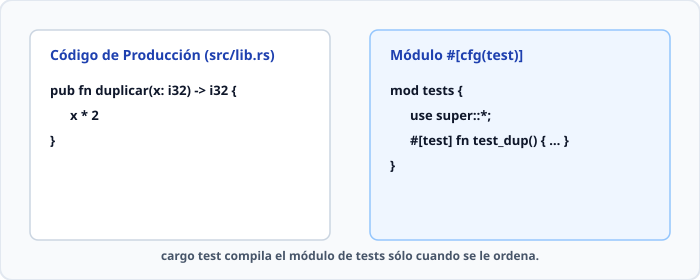


---

## 4. Pruebas de Integración: LaCarpeta `/tests`

Mientras los tests unitarios prueban funciones aisladas y privadas, los **tests de integración** se ubican en una carpeta raíz llamada `tests/`. Simulan ser un cliente externo usando tu crate como si fuera una librería instalada desde `crates.io`.

```
mi_proyecto/
├── Cargo.toml
├── src/
│   └── lib.rs
└── tests/
    └── integration_test.rs  <-- Cada archivo aquí es un crate independiente
```

Ejemplo dentro de `tests/integration_test.rs`:

```rust
// No necesitas #[cfg(test)] aquí, Cargo ya sabe que esta carpeta es para pruebas.
use mi_proyecto;

#[test]
fn test_conexion_externa() {
    let resultado = mi_proyecto::sumar(10, 20);
    assert_eq!(resultado, 30);
}
```

Para correr únicamente las pruebas de integración específicas de un archivo:
```bash
cargo test --test integration_test
```

---

> 🟥 **FRENAZO DEL COMPILADOR:** Intentar importar funciones privadas desde un test de integración externo.
> 
> ```text
> error[E0603]: function `funcion_secreta` is private
>  --> tests/integration_test.rs:3:22
>   |
> 3 | use mi_proyecto::funcion_secreta;
>   |                   ^^^^^^^^^^^^^^ private function
> ```
> 
> **Por qué ocurre:** Los tests de integración son **consumidores externos** (como cualquier usuario en internet). Solo pueden acceder a funciones marcadas con `pub`. Si quieres probar lógica interna privada, usa un test unitario dentro del mismo archivo `src/lib.rs`.

---

## Resumen del Comando `cargo test`

* `cargo test`: Ejecuta todas las pruebas unitarias e de integración en paralelo.
* `cargo test nombre_de_test`: Ejecuta únicamente las pruebas cuyo nombre coincida con el patrón.
* `cargo test -- --nocapture`: Muestra por consola los `println!` dentro de tus tests (útil para debug rápido).

\pagebreak

# Capítulo 23: Asincronía Moderna: async/.await y Futures Frente a Node.js

> 🧠 **EN 10 SEGUNDOS (TDAH):** 
> En Rust, un `Future` no hace nada hasta que alguien lo ejecuta (es perezoso). Usamos un runtime como Tokio para manejar millones de conexiones ligeras usando pocos hilos de sistema operativo.

---

## 1. El Problema del Millón de Conexiones (C10K) y los Hilos del Sistema Operativo

Imagina que estás organizando una fiesta. Si le asignas un mesero exclusivo a cada invitado (como hacen los hilos tradicionales del SO), tu casa colapsa rápido porque los meseros ocupan espacio y energía física, aunque los invitados estén en silencio. 

En programación, un hilo del sistema operativo consume memoria dedicada (unos 2 Megabytes para el Stack) y requiere cambios de contexto costosos en la CPU. Si intentas abrir 10,000 conexiones concurrentes con hilos puros, tu servidor se queda sin memoria o pasa más tiempo cambiando de hilo que procesando datos reales.

> 🟦 **CONEXIÓN TYPESCRIPT/JAVASCRIPT:** 
> En Node.js estás acostumbrado al modelo *Event Loop*. Un solo hilo ejecuta tu código de JavaScript de forma asíncrona mediante callbacks, Promises y eventos del sistema operativo subyacente (como `libuv`). Rust te da una velocidad similar o superior, pero **sin un hilo principal obligatorio oculto**, permitiéndote decidir exactamente cómo y dónde corre tu código.

---

## 2. El Modelo de Rust: Futures Perezosos (Pull-Based) vs. Promesas de JS (Push-Based)

Aquí está la diferencia mental más importante que debes hacer:

*   **JavaScript (Push-based):** Una `Promise` en JS nace corriendo. En el momento exacto en que la creas, el motor comienza a trabajar en segundo plano.
*   **Rust (Pull-based):** Un `Future` en Rust es un objeto pasivo. No hace **absolutamente nada** hasta que alguien lo llama (`poll`) explícitamente y lo empuja hacia adelante.


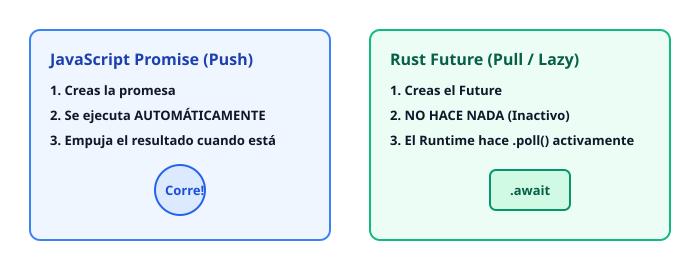


---

## 3. ¿Por qué Rust no trae Runtime por Defecto?

A diferencia de Go o Node.js, Rust no incluye un recolector de basura ni un motor asíncrono incrustado en el lenguaje. 

*   **Filosofía de Rust:** No pagas por lo que no usas. Si creas un microcontrolador embebido de 8 KB, no quieres un pesado sistema de tareas asíncronas consumiendo recursos.
*   **La Solución:** Delegamos el trabajo pesado a crates externos probados en batalla. El rey indiscutible del ecosistema es **Tokio**.

---

## 4. Sintaxis Práctica: async fn, .await y Tokio

Para usar asincronía en Rust, decoramos nuestras funciones con `async fn` y usamos la macro principal de Tokio para inicializar el motor del runtime.

```rust
// Agrega tokio = { version = "1.40", features = ["full"] } en tu Cargo.toml
use tokio::time::{sleep, Duration};

async fn descargar_datos(id: u32) -> String {
    // Simulamos una operación de red no bloqueante
    sleep(Duration::from_secs(1)).await;
    format!("Datos del usuario {}", id)
}

#[tokio::main]
async fn main() {
    println!("Iniciando descargas...");

    // Llamamos a la función async (devuelve un Future perezoso)
    let futuro_usuario = descargar_datos(42);

    // El .await pausa esta función hasta que el Future termine
    let resultado = futuro_usuario.await;
    
    println!("{}", resultado);
}
```

> 🟥 **FRENAZO DEL COMPILADOR:**
> Si intentas llamar a una función `async fn` sin ponerle `.await` al final, el compilador te gritará algo como esto:
> ```text
> warning: unused `impl std::future::Future` that must be used
>   --> src/main.rs:10:5
>   |
> 10 |     descargar_datos(42);
>   |     ^^^^^^^^^^^^^^^^^^^^
>   |
>   = note: futures do nothing unless you `.await` or poll them
> ```
> **El bug que evita:** Olvidar el `.await` en JS suele devolver una `Promise` vacía y romper tu lógica silenciosamente. En Rust, el compilador te obliga a reconocer explícitamente que tienes un futuro pendiente de resolución.

---

## 5. Concurrencia Avanzada: tokio::spawn y tokio::select!

Cuando quieres ejecutar múltiples tareas en paralelo sin bloquear el hilo principal, usas `tokio::spawn` para lanzar tareas independientes (tasks) y `tokio::select!` para competir entre varias operaciones asíncronas (el primero que responda gana).

```rust
use tokio::time::{sleep, Duration};

#[tokio::main]
async fn main() {
    // Lanzamos dos tareas concurrentes en segundo plano
    let tarea_1 = tokio::spawn(async {
        sleep(Duration::from_millis(500)).await;
        "Resultado de Tarea 1"
    });

    let tarea_2 = tokio::spawn(async {
        sleep(Duration::from_millis(200)).await;
        "Resultado de Tarea 2"
    });

    // tokio::select! espera a que la primera tarea termine
    tokio::select! {
        res1 = tarea_1 => println!("Ganó: {:?}", res1),
        res2 = tarea_2 => println!("Ganó: {:?}", res2),
    }
}
```

> 🟦 **CONEXIÓN TYPESCRIPT/JAVASCRIPT:**
> `tokio::spawn` es conceptualmente muy similar a disparar una promesa en JS sin hacerle `await` inmediato (ej. `Promise.all` o simplemente iniciar tareas independientes). Por su parte, `tokio::select!` es el equivalente robusto y seguro en tipos de `Promise.race([])`, pero optimizado a nivel de sistema para cancelar las ramas perdedoras de manera automática y limpia.

\pagebreak

# Capítulo 24: Técnicas Avanzadas del Día a Día: dyn Trait, Deref y Structs con Lifetimes

> 🧠 **EN 10 SEGUNDOS (TDAH):** Hoy aprenderemos herramientas de nivel senior: polimorfismo flexible con `dyn Trait`, conversión automática de tipos con `Deref`, cómo guardar referencias dentro de structs usando `lifetimes`, y cómo apagar hilos de forma ordenada con el trait `Drop`.

---

## 1. Polimorfismo: `impl Trait` (Estático) vs `dyn Trait` (Dinámico)

Hasta ahora hemos usado genéricos (`<T: Trait>`) y `impl Trait`. Esto se conoce como **despacho estático** (static dispatch). 
El compilador clona el código para cada tipo concreto que uses en tiempo de compilación (un proceso llamado *monomorphization*). Es ultra rápido, pero todos los elementos de una colección deben ser exactamente del mismo tipo.

¿Qué pasa si quieres una lista (`Vec`) que contenga structs totalmente diferentes pero que cumplan el mismo `Trait`? Aquí entra el **despacho dinámico** (dynamic dispatch) usando `dyn Trait` detrás de un puntero como `Box<dyn Trait>` o `&dyn Trait`.

> 🟦 **CONEXIÓN TYPESCRIPT/JAVASCRIPT:** En JS/TS todo es dinámico por defecto; puedes meter objetos con la misma interfaz en un array sin preocuparte. En Rust, por defecto todo es estático y estricto. Usar `Box<dyn Trait>` es la forma explícita de decir: *"Quiero polimorfismo de tiempo de ejecución como en TypeScript"*.

### Ilustración: Despacho Estático vs Dinámico


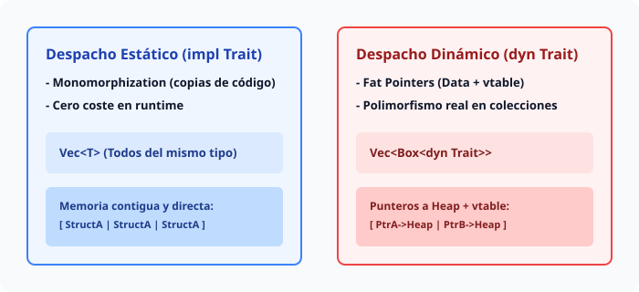


> 🟥 **FRENAZO DEL COMPILADOR:** Si intentas crear `let lista: Vec<dyn Trait> = ...`, Rust te dirá que el trait no tiene un tamaño conocido en tiempo de compilación (*size known at compile-time*). Por eso siempre debes envolverlo en un puntero indirecto como `Box<dyn Trait>` o `&dyn Trait`.

---

## 2. Coerción Deref: Magia Limpia y Sin Coste

El operador `*` se usa para desreferenciar un puntero y acceder al valor interno. Pero Rust va más allá con el trait `Deref`. Gracias a esto, un `&String` se convierte automáticamente en un `&str`, y un `&Vec<T>` en un `&slice<T>` (`&[T]`).

Esto explica por qué puedes pasar una referencia a un `String` a una función que espera un `&str` sin escribir asteriscos molestos.

```rust
fn imprimir_texto(s: &str) {
    println!("Texto: {}", s);
}

fn main() {
    let meu_string = String::from("Hola Rust 2024");
    
    // Coerción Deref automática: &String se convierte en &str
    imprimir_texto(&meu_string);
}
```

---

## 3. Structs con Lifetimes: Almacenando Referencias

Si un `struct` contiene una referencia (ej. `&str`), el compilador de Rust **exige** que declares un parámetro de lifetime (`'a`) para garantizar que la referencia dentro del struct nunca sobreviva al dato original al que apunta.

```rust
// Este struct no posee los datos, solo los presta (borrow)
struct Articulo<'a> {
    titulo: &'a str,
    contenido: &'a str,
}

fn main() {
    let texto_largo = String::from("Rust es seguro y rápido.");
    
    let articulo = Articulo {
        titulo: "Aviso",
        contenido: &texto_largo,
    };

    println!("Artículo: {} -> {}", articulo.titulo, articulo.contenido);
} // articulo muere aquí, texto_largo muere después. ¡Todo seguro!
```

> 🟥 **FRENAZO DEL COMPILADOR:** Si omites el lifetime (`struct Articulo { titulo: &str }`), el compilador te lanzará un error de *missing lifetime specifier*. Rust se niega a compilar código donde no esté claro quién es el dueño del dato prestado.

---

## 4. El Lifetime `'static`

El lifetime `'static` es especial. Significa que el dato vive **durante toda la ejecución del programa**.

1. **Literales de texto:** Todos los strings escritos directamente en el código (`&str`) tienen por defecto el lifetime `'static` porque están incrustados en el binario ejecutable.
2. **Hilos concurrentes:** En concurrencia, `T: 'static` significa que el tipo no contiene referencias prestadas de vida corta, por lo que es seguro enviarlo a otro hilo mediante `std::thread::spawn`.

---

## 5. Graceful Shutdown usando el trait `Drop`

Cuando un recurso sale de scope en Rust, se ejecuta automáticamente su destructor implementando el trait `Drop`. Esto es la base del patrón RAII (*Resource Acquisition Is Initialization*).

Imagina un ThreadPool avanzado: cuando el pool se destruye, queremos avisar a los hilos de que terminen de procesar sus tareas pendientes de forma ordenada (*Graceful Shutdown*).

```rust
use std::thread;
use std::sync::{mpsc, Arc, Mutex};

struct Worker {
    id: usize,
    thread: Option<thread::JoinHandle<()>>,
}

impl Worker {
    fn new(id: usize) -> Worker {
        // Creamos un hilo simulado
        let handle = thread::spawn(move || {
            println!("Worker {} iniciado.", id);
        });

        Worker {
            id,
            thread: Some(handle),
        }
    }
}

struct MiThreadPool {
    workers: Vec<Worker>,
}

// Implementamos Drop para asegurar un apagado limpio
impl Drop for MiThreadPool {
    fn drop(&mut self) {
        println!("\nApagando ThreadPool ordenadamente (Graceful Shutdown)...");

        for worker in &mut self.workers {
            println!("Apagando worker id: {}", worker.id);
            
            if let Some(thread_handle) = worker.thread.take() {
                thread_handle.join().unwrap();
            }
        }
    }
}

fn main() {
    let pool = MiThreadPool {
        workers: vec![Worker::new(1), Worker::new(2)],
    };

    println!("El programa principal está haciendo tareas...");
} // <- Aquí la variable 'pool' sale de scope, se ejecuta Drop automáticamente y se unen los hilos.
```

---

## Resumen del Capítulo

- **Despacho Dinámico (`dyn Trait`):** Permite colecciones heterogéneas usando punteros inteligentes como `Box<dyn Trait>`.
- **Deref Coercion:** Conversión automática de tipos derivados a tipos base (`&String` a `&str`).
- **Structs con Lifetimes (`'a`):** Garantizan que las referencias internas no superen en vida al dato original.
- **Trait `Drop`:** Control total sobre el momento en que los recursos se destruyen, clave para un apagado seguro de hilos.

\pagebreak

# Capítulo 25: Unsafe Rust: Rompiendo el Cristal de Emergencia

> 🧠 **EN 10 SEGUNDOS (TDAH):** `unsafe` no desactiva el compilador de Rust. Solo te otorga 5 superpoderes para saltarte temporalmente el chequeo de borrowing estático, permitiéndote interactuar con hardware, código C o construir estructuras de datos complejas bajo tu propia responsabilidad.

Rust es famoso por su seguridad estricta en tiempo de compilación. Sin embargo, el mundo real es complejo: necesitamos hablar con sistemas operativos, hardware de bajo nivel o bibliotecas escritas en C. 

Para eso existe `unsafe`. No significa "código mal hecho", significa: *"Compilador, confía en mí, yo me encargo de mantener las reglas lógicas"*.

---

## Los 5 Superpoderes de `unsafe`

La palabra clave `unsafe` por sí sola no hace nada. Desbloquea exactamente cinco capacidades que el código seguro tiene prohibidas:

1. Desreferenciar punteros crudos (*raw pointers*).
2. Llamar a funciones o métodos `unsafe` (incluyendo funciones C externas).
3. Implementar traits `unsafe`.
4. Mutar o leer variables estáticas mutables (`static mut`).
5. Acceder a campos de un `union`.

Veamos visualmente cómo el compilador actúa como guardia de seguridad, y cómo `unsafe` abre la puerta blindada bajo tu supervisión:


---

## Punteros Crudos (*const T, *mut T) vs Referencias Seguras (&T)

Las referencias seguras (`&T` y `&mut T`) siempre apuntan a datos válidos, no pueden ser nulas y respetan estrictamente las reglas de préstamo. 

Los punteros crudos (`*const T` y `*mut T`) son exactamente iguales a los punteros de C o C++:
* Pueden ser nulos (null).
* Pueden apuntar a memoria inválida o liberada.
* Ignoran por completo las reglas de mutabilidad compartida del compilador.

```rust
fn main() {
    let mut num = 5;

    // Crear punteros crudos es SEGURO (no requiere bloque unsafe)
    let r1 = &num as *const i32;
    let r2 = &mut num as *mut i32;

    // DESREFERENCIARlos requiere un bloque unsafe obligatoriamente
    unsafe {
        println!("r1 apunta a: {}", *r1);
        println!("r2 apunta a: {}", *r2);
        
        // Modificamos a través del puntero crudo mutable
        *r2 = 10;
        println!("num ahora es: {}", num);
    }
}
```

> 🟦 **CONEXIÓN TYPESCRIPT/JAVASCRIPT:** En JS/TS, *todo* es esencialmente un puntero crudo o una referencia mutable compartida bajo el capó. Mutas objetos globales o pasas referencias sin que el motor V8 te detenga. En Rust, jugar con memoria directa requiere declarar explícitamente el bloque `unsafe`.

---

## Modificar Variables Estáticas Mutables Globales

En Rust, el estado global mutable es peligroso porque múltiples hilos pueden acceder a él causando condiciones de carrera (*data races*). Por defecto está prohibido, pero `static mut` te deja hacerlo bajo tu propio riesgo:

```rust
static mut CONTADOR_GLOBAL: u32 = 0;

fn incrementar(val: u32) {
    // Modificar un static mut es unsafe porque no hay exclusión mutua automática
    unsafe {
        CONTADOR_GLOBAL += val;
    }
}

fn main() {
    incrementar(5);
    unsafe {
        println!("Contador global: {}", CONTADOR_GLOBAL);
    }
}
```

> 🟥 **FRENAZO DEL COMPILADOR:**
> ```text
> error[E0133]: use of mutable static is unsafe and requires unsafe block
>  --> src/main.rs:5:5
>   |
> 5 |     CONTADOR_GLOBAL += val;
>   |     ^^^^^^^^^^^^^^^^^^^^^^ use of mutable static
>   |
>   = note: mutable statics can be mutated by multiple threads: race conditions
> ```
> **Por qué ocurre:** Rust te obliga a poner el bloque `unsafe` para recordarte que si dos hilos tocan `CONTADOR_GLOBAL` al mismo tiempo, tu programa tendrá comportamiento indefinido (*Undefined Behavior*).

---

## Llamando a Código C Externo (FFI)

Uno de los usos más legítimos de `unsafe` es interactuar con bibliotecas escritas en C utilizando la Interfaz de Idioma Foráneo (FFI).

```rust
// Declaramos una función externa escrita en C (por ejemplo, la función abs de la libc)
extern "C" {
    fn abs(input: i32) -> i32;
}

fn main() {
    // Llamar a código externo siempre se considera unsafe porque Rust no puede
    // garantizar qué hará ese código C por debajo.
    let resultado = unsafe {
        abs(-42)
    };
    
    println!("El valor absoluto de -42 es: {}", resultado);
}
```

---

## La Regla de Oro: Encapsular lo Inseguro

Nunca debes propagar `unsafe` por todo tu código de aplicación. La regla de oro en Rust es: **Usa `unsafe` en las tripas de una estructura, pero expón una API totalmente segura al exterior.**

Imagina construir tu propio vector o puntero inteligente. Por dentro usas punteros crudos y memoria manual, pero por fuera el usuario usa código 100% seguro:


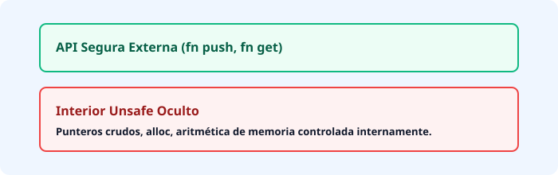


Al encapsular el peligro, garantizas que los errores de memoria queden confinados en un espacio muy pequeño, facilitando las auditorías de seguridad de tu software.

\pagebreak

# Capítulo 26: Macros Declarativas: Código que Escribe Código

> 🧠 **EN 10 SEGUNDOS (TDAH):** Las funciones ejecutan código en tiempo de ejecución. Las macros declarativas son robots que leen tu código y **escriben más código** antes de que el programa siquiera compile.

---

## 1. La Diferencia Fundamental: ¿Función o Macro?

Para entender las macros, imagina que estás en una pizzería:

*   **Una Función:** Es un pizzero trabajando en la cocina. Le pasas ingredientes (argumentos) y te devuelve una pizza (un resultado) cuando se lo pides.
*   **Una Macro:** Es una fábrica automática de pizzerias. Le das un plano rápido y la fábrica construye una cocina entera antes de abrir el restaurante.

En Rust, las funciones operan con **datos**. Las macros operan con la **sintaxis misma del lenguaje** (el código fuente).


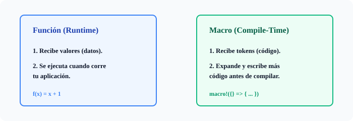


---

## 2. Metaprogramación: Rust vs. TypeScript/JavaScript

> 🟦 **CONEXIÓN TYPESCRIPT/JAVASCRIPT:** En TS/JS, si quieres generar código dinámicamente o evitar repetir lógica compleja, usas `eval()`, funciones de orden superior, o decoradores experimentales. Pero `eval()` es peligroso, lento y un infierno para el tipado estricto. Las macros en Rust ocurren en el **servidor de compilación**, son totalmente seguras contra inyecciones y devienen en código nativo ultrarrápido sin penalización en runtime.

---

## 3. Anatomía de `macro_rules!` y Pattern Matching

Las macros declarativas en Rust se construyen usando `macro_rules!`. Funcionan como un sistema de `match` pero aplicado a **estructuras sintácticas** (tokens), no a valores numéricos o de texto.

Construyamos paso a paso una macro llamada `habla!` que imprima un mensaje dependiendo de si le pasamos un perro o un gato.

```rust
macro_rules! habla {
    // 1. Patrón para cuando recibe "perro"
    (perro) => {
        println!("¡Guau guau!");
    };
    
    // 2. Patrón para cuando recibe "gato"
    (gato) => {
        println!("¡Miau!");
    };
}

fn main() {
    habla!(perro); // Imprime: ¡Guau guau!
    habla!(gato);  // Imprime: ¡Miau!
}
```

### ¿Qué significan los símbolos raros ($)?

En las macros verás símbolos como `$x:expr`. Esto se llama un **fragment specifier** (capturador):
*   `$` indica una variable de macro.
*   `x` es el nombre que le das a esa parte del código capturado.
*   `:expr` le dice a Rust qué tipo de estructura sintáctica debe coincidir (en este caso, una **expresión**).

Otros fragmentos comunes son `:ident` (para nombres de variables o funciones) y `:block` (para bloques de código `{}`).

---

## 4. Creación Práctica: Una Macro de Vectores Seguros

Imagina que estás harto de escribir `vec![1, 2, 3]` y quieres una macro propia que cree vectores multiplicando cada elemento por 2 automáticamente.


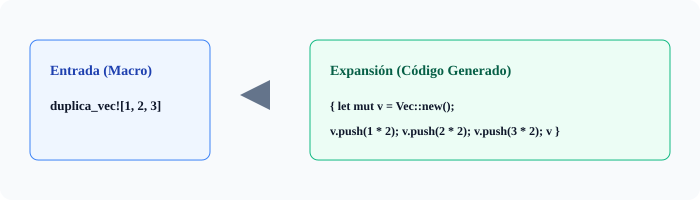


Aquí tienes el código completo usando repeticiones (`$()*`):

```rust
macro_rules! duplica_vec {
    // El asterisco (*) significa "se puede repetir cero o más veces" separado por comas
    ( $( $x:expr ),* ) => {
        {
            let mut temp_vec = Vec::new();
            $(
                temp_vec.push($x * 2);
            )*
            temp_vec
        }
    };
}

fn main3() {
    let mi_vector = duplica_vec![10, 20, 30];
    println!("{:?}", mi_vector); // Imprime: [20, 40, 60]
}
```

> 🟥 **FRENAZO DEL COMPILADOR:**
> Si intentas usar tu macro pasando un token incorrecto, por ejemplo olvidando la coma o pasando un bloque donde esperaba una expresión, el compilador te mostrará un error críptico señalando la expansión:
> ```text
> error: no rules expected the token `+`
>   --> src/main.rs:15:20
>    |
> 15 |     duplica_vec![1 + ];
>    |                    ^
> ```
> **Por qué ocurre:** Las macros comparan la sintaxis literal contra patrones predefinidos. Si escribes código incompleto, el patrón no hace `match` y el compilador grita. **Consejo Pro:** Usa `cargo rustc -- -Z unstable-options --pretty=expanded` para ver exactamente en qué se convierte tu macro.

\pagebreak

# Capítulo 27: Workspaces de Cargo: Monorrepositorios Profesionales

> 🧠 **EN 10 SEGUNDOS (TDAH):** Un **workspace** de Cargo une múltiples `crates` independientes en un solo directorio raíz. Comparten la misma carpeta `target/` y el archivo `Cargo.lock`, ahorrando gigabytes de disco y acelerando las compilaciones a lo loco.

Organizar código a medida que crece es un reto. Si creas proyectos separados para tu API, tu cliente CLI y tu librería compartida, terminarás copiando archivos o duplicando dependencias. 

Los **Cargo Workspaces** solucionan esto permitiéndote gestionar múltiples subproyectos bajo un mismo techo sin perder su independencia.

---

## Anatomía de un Workspace en Rust

Un workspace se define mediante un archivo `Cargo.toml` raíz que **no tiene código fuente propio**, sino que actúa como director de orquesta.

```toml
[workspace]
members = [
    "core_engine",
    "cli_tool",
    "api_server"
]
resolver = "2"
```

Cada miembro (`core_engine`, `cli_tool`, `api_server`) es un `crate` totalmente normal con su propia carpeta y su propio `Cargo.toml`.

<div align="center">


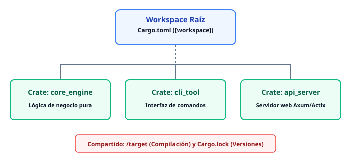


</div>

---

## Dependencias Internas y Versiones Compartidas

Para que `cli_tool` use el `core_engine`, solo debes declararlo en su propio `Cargo.toml` usando rutas relativas:

```toml
# cli_tool/Cargo.toml
[dependencies]
core_engine = { path = "../core_engine" }
```

### El superpoder del `[workspace.dependencies]`
Desde Rust 1.64+, puedes centralizar las versiones de tus dependencias externas en la raíz. Así evitas que un crate use `tokio = "1.28"` y otro `tokio = "1.35"`.

```toml
# Cargo.toml (Raíz del Workspace)
[workspace]
members = ["core_engine", "cli_tool"]
resolver = "2"

[workspace.dependencies]
tokio = { version = "1.38", features = ["full"] }
serde = { version = "1.0", features = ["derive"] }
```

Luego, en los miembros del workspace, las consumes sin especificar la versión:

```toml
# core_engine/Cargo.toml
[dependencies]
tokio.workspace = true
serde.workspace = true
```

> 🟦 **CONEXIÓN TYPESCRIPT/JAVASCRIPT:** En el ecosistema Node.js, esto equivale exactamente a los **pnpm workspaces** o **Turborepo** combinados con `workspace:*` en el `package.json`. La gran diferencia: Rust compila todo nativamente de forma incremental y maneja los binarios con un único `Cargo.lock` blindado contra el "dependency hell".

---

## Errores Comunes de Compilación

> 🟥 **FRENAZO DEL COMPILADOR:** Intentar compilar un crate de forma aislada (*fuera del workspace*) usando dependencias relativas rotas o versiones no sincronizadas.
>
> ```text
> error: no matching package found for `core_engine`
> location searched: fileложена dependency path
> ```
> **Por qué ocurre:** Si ejecutas `cargo build` dentro de la carpeta `cli_tool/` sin tener en cuenta el workspace raíz, Cargo buscará el crate en crates.io en lugar de mirar dos carpetas hacia arriba.
> **Solución:** Ejecuta siempre los comandos de Cargo desde la raíz del workspace, o usa la bandera `--manifest-path`. Cargo es inteligente y detectará automáticamente el workspace si estás dentro de cualquiera de sus subcarpetas.

\pagebreak

